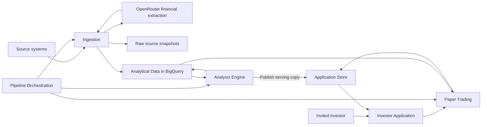

## Public Baseline: Architecture (1/3)

# Gate 2 - Architecture Design

**Status:** FINAL

**Version:** 1.0

**Date:** 2026-09-20

**Input reference:** Tradvisor BRVM - V1 Business Requirements Document, version 1.23 (`tradvisor_brd.md`), supplemented by the architecture discussion

**Author:** Software Architect Agent

## 1. Executive Summary

Tradvisor V1 serves a small invited group with equally important Swing and Long-Term workflows.
Ingestion reuses the production scripts copied into `archive/legacy-ingestion/scripts/`, covering shares, dividends, financials, and ratings.
Daily market signals and Long-Term scores are calculated once and shared across users.
Keep and Sell advice is personalized using a user's paper positions and does not automatically create orders.
BigQuery owns analytical datasets; the confirmed structured Firestore model owns paper orders, balances, and user settings.
The existing Google Cloud infrastructure provides the initial reuse foundation, with scale-to-zero application compute and shared batch calculations as cost priorities.
The confirmed frontend uses Next.js and TypeScript, Tailwind/shadcn, TanStack Table v8, Lightweight Charts, Recharts, and resizable desktop panels.
The approved design is ready for task orchestration; deployment preservation, source verification and release acceptance remain explicit implementation gates.

## 2. Business Context & Drivers

**Approved coverage amendment (2026-09-20):** One year of dividend history is available; further history cannot currently be acquired. Dividend research remains in V1, but full Dividend and Balanced scores, their rankings and recommendations are deferred. This supersedes earlier three-score requirements and implementation notes throughout this architecture. Financial contract v1.1 section 1 is normative. Retain earlier Dividend/Balanced formulas only as future design references, not implementation/backfill/release blockers. Growth requirements are unchanged; missing fiscal years must not be interpolated. A potentially missing fiscal year is unconfirmed in the full dataset.

The Analysis Engine publishes Growth scores only with complete required inputs, and supported dividend facts with coverage metadata. Historical ordinary yield requires a verified complete trailing-12-month window and compatible payment/share/price basis. Investor Application keeps dividend research accessible without suggesting a composite rating or suitability ranking. API/serving contracts expose deferred Dividend/Balanced scores as null with an explicit deferred-scope reason, distinct from missing Growth inputs; no yield-only substitute or automatic future activation. Preserve three-objective identifiers where needed for version compatibility, but do not present Balanced as an active V1 scoring workflow. Tests verify these scope states and that one-year evidence cannot generate multi-year dividend conclusions. Swing and paper trading are unchanged.

Confirmed architecture decisions from the stakeholder discussion:

- V1 access is limited to a small invited group.
- Ingestion is part of the implementation. Reuse `archive/legacy-ingestion/scripts/` and improve it where necessary; the stakeholder confirmed this source location.
- Shared market recommendations cover every stock. Keep and Sell advice depends on a user's paper holdings.
- Both investor workflows remain equally important V1 deliverables.
- All paper orders are user initiated, long-only, and priced at the next trading session's close.
- Real holdings, broker integration, and Coris imports remain outside V1.
- BigQuery views or derived tables are interchangeable implementation options subject to performance and FinOps needs.
- The frontend stack is confirmed: Next.js App Router with React and TypeScript; Tailwind CSS and shadcn/ui; TanStack Table v8; TradingView Lightweight Charts for Swing; Recharts with shadcn chart components for Long-Term and paper performance; and react-resizable-panels through shadcn's Resizable integration. Tremor is not included in V1.
- Financial indicator, scoring, and paper-account calculations remain authoritative on the backend. The frontend displays the published values and explanations.
- Operating cost should be as low as practical. EUR 5/month is an indicative target, not a hard spending ceiling or an instruction to suspend the application.
- Avoid Cloud SQL, self-managed database VMs, and always-on application compute. Interactive compute must scale to zero when idle; scheduled processing runs only when required and terminates afterward.
- Prefer computing shared indicators and scores once per daily publication in BigQuery when SQL is efficient. Compare actual total costs before placing exceptional calculations in short-lived Python jobs; BigQuery is not assumed universally cheaper.
- FastAPI/Python remains the backend direction. The stakeholder confirmed a static Next.js frontend, hosted on Firebase Hosting in the approved deployment baseline. Firebase Authentication is the confirmed identity provider.
- The stakeholder selected option 2, the structured transactional model on Firestore: separate user, portfolio-summary, position, order, execution, and cash-movement records, with atomic updates and resource-oriented REST endpoints. Compact embedded portfolio state and event sourcing were not selected.
- Paper-trading conventions are confirmed: one additional trading session of grace for the original intended closing price, then expiry; explicit fee selection with a submission-time rate snapshot and whole-XOF half-up fee rounding; full rejection of unaffordable orders without partial fills; weighted-average purchase cost with separately allocated purchase fees; and position-level holding/exit references that reset only when the position is fully closed. BRD section 6.3 records the business contract.
- The V1 core technical indicators are EMA 20/50, Wilder RSI 14, Wilder ATR 14, and median traded value over 20 exchange trading sessions. Scored trend confirmation, including the BRD section 6.4 partial-credit formulas and structural guards, is approved as a provisional evaluation baseline. Later app versions may replace the strategy. Other indicator families are deferred; the former breakout/relative-volume rule is not retained. Initialization/warm-up, session handling and factual evidence-status semantics are adopted in `tradvisor_financial_contract.md`. The agreed paper-accounting and position-exit references are unchanged.

The BRD retains its existing IDs. The confirmed distinction between market signals and holding advice refines FR-SW-01 and FR-SW-06: one shared market state is not itself a personalized exit instruction.

Handoff authority: BRD v1.23 and its later approved amendments govern scope; financial contract v1.1 governs calculations; API/data contract v0.13 governs transport and state; integration design v1.0 governs calendar, execution publication and recovery ordering. This final architecture integrates the stakeholder-approved decisions without asserting implementation, empirical effectiveness or release approval. Earlier blanket exclusions of corporate-action/valuation calculations do not exclude the explicitly adopted analytical basis checks and Growth valuation inputs in BRD section 6.6; automated corporate-action processing of paper holdings and real-account reporting remain outside V1. Source mapping v0.5 and the environment assessment are evidence/worklists, not proof of complete coverage. Unverified facts have conservative treatment and validation owners in section 11.

## 3. Requirements Traceability

| Req ID | Requirement | Design decision | Component(s) | Reused/New |
|--------|-------------|-----------------|--------------|------------|
| FR-SW-01 | Daily stock coverage | Shared market state for every stock; separate holding advice when a user owns paper shares | Analysis Engine, Investor Application, Paper Trading | New |
| FR-SW-02 | Insufficient-data state | Explicit unavailable result with reason | Analysis Engine | New |
| FR-SW-03 | Signal strength, evidence status and explanation | Store factual availability, freshness, input basis and rule explanations; no separate probability-like confidence percentage | Analysis Engine, Investor Application | New |
| FR-SW-04 | EMA, RSI, ATR, and traded value | Publish dated, versioned series and explanations with explicit warm-up and actual/estimated turnover semantics | Analytical Data, Analysis Engine | Reused / New |
| FR-SW-05 | V1 trend confirmation, replaceable in future versions | Isolate the selected strategy behind a stable evaluation contract; implement adopted comparisons/thresholds, version parameters and preserve original results | Analysis Engine | New |
| FR-SW-06 | Exit advice | Weighted-average gross entry price for stop loss, highest close since opening for trailing advice, and uninterrupted holding timer until fully sold; no automatic order | Paper Trading | New |
| FR-SW-07 | Historical evidence | Immutable result versions and references to input snapshots | Analytical Data, Analysis Engine | Reused / New |
| FR-PT-01 | Manual orders including Keep override | Authenticated command creates a recommendation-linked pending order; Sell from Keep requires explicit acknowledgment and server-derived advice/override evidence | Paper Trading | New |
| FR-PT-02 | Next-session close and delayed-price grace | Persist intended session; allow one additional session for its price, then expire without later-session substitution | Paper Trading, Pipeline Orchestration | New / Reused |
| FR-PT-03 | Long-only | Enforce nonnegative holdings in a transaction | Paper Trading, Application Store | New |
| FR-PT-04 | XOF, starting cash, fee | Default starting cash 1,000,000 XOF; whole-XOF range 100,000-100,000,000 inclusive at setup/reset only; no top-ups. Explicit fee selection and frozen per-order fees | Paper Trading, Application Store | New |
| FR-PT-05 | Cash and holdings constraints | Reserve and recheck resources; reject unaffordable orders in full and release reservations | Paper Trading, Application Store | New |
| FR-PT-06 | Portfolio reporting | Weighted-average cost, proportional purchase-fee allocation, and separate gross/net realized/unrealized P&L | Paper Trading, Investor Application | New |
| FR-PT-07 | Reset | Reset atomically and fence out jobs targeting the previous simulation | Paper Trading, Application Store | New |
| FR-LT-01 | Growth and dividend research | Growth rankings and dividend facts; Balanced scoring deferred | Investor Application, Analysis Engine | New |
| FR-LT-02 | Growth score, partial coverage and launch review | Keep all catalog companies visible; complete-input Growth scores only, separate partial/unavailable states and independent advice guards. Product-owner review of actual company/sector coverage before launch; no numeric minimum or formula relaxation adopted. Dividend/Balanced scores remain null | Analysis Engine, Investor Application | New |
| FR-LT-03 | Sector-aware Growth scorecard | Preserve full Growth inputs, weights and guards; no missing-year interpolation or dividend proxy score | Analysis Engine | New |
| FR-LT-04 | Score explanation | Persist factor contributions, periods, source links, and alerts | Analysis Engine, Analytical Data | New / Reused |
| FR-LT-05 | Supported measures | Normalize source fields into documented calculation contracts | Ingestion, Analytical Data, Analysis Engine | Reused / New |
| FR-LT-06 | Alerts | Derive alerts alongside Long-Term results | Analysis Engine | New |
| FR-LT-07 | Unavailable companies | Preserve coverage without assigning invented scores | Analysis Engine, Investor Application | New |
| NFR-01 | Market date | Separate observation, trading-session, and publication timestamps | Ingestion, Analysis Engine | Reused / New |
| NFR-02 | Reproducibility | Snapshot inputs and configuration; make retries idempotent | Ingestion, Analysis Engine, Paper Trading | Reused / New |
| NFR-03 | Calculation safety | Automated tests and runtime calculation guards | Ingestion, Analysis Engine | Reused / New |
| NFR-04 | Strategy separation | Separate application workspaces and result types | Investor Application | New |
| NFR-05 | Performance and cost | Batch shared analysis; choose physical BigQuery structures after measurement | Analytical Data, Pipeline Orchestration | Reused |
| NFR-06 | Understandable outputs | Expose explanatory evidence alongside every result | Investor Application, Analysis Engine | New |
| NFR-07 | Pilot capacity and publication targets | Test 25 invited users/5 concurrent sessions, p95 normal reads <=2 seconds excluding cold starts/network, publication <=15 minutes after required inputs ready | Investor Application, Analysis Engine, Pipeline Orchestration | New / Reused |
| NFR-08 | Recovery and best-effort availability | Daily backups retained 7 days; recovery <=24 hours after acknowledgement from latest successful usable backup, no fixed maximum loss; monitor backup age/failures and disclose recovery point; cost validation and reset/access-safe restore drill before release | Application Store, Paper Trading, Pipeline Orchestration | New / Reused |
| NFR-09 | Retention | Apply section 9 lifecycle rules, evidence dependencies, 30-day receipts/logs and reset deletion deadlines | Analytical Data, Analysis Engine, Application Store, Paper Trading | Reused / New |
| NFR-10 | WCAG 2.2 AA target | Complete-workflow automated and manual keyboard/screen-reader checks, accessible chart tables and non-color-only advice | Investor Application | New |
| DR-01 | Five source tables | Establish a source contract for each named BRD table | Ingestion, Analytical Data | Reused |
| DR-02 | BigQuery analytical structures | Preserve the BigQuery platform; physical structure remains selectable | Analytical Data | Reused |
| DR-03 | Tested data assumptions | Fixture-based parser and calculation tests; no data-quality product workflow | Ingestion, Analysis Engine | Reused / New |
| BRD-C-01 | BRD sections 5 and 10: scope exclusions | Application has no real-account, import, broker-execution, or short-selling capability | Investor Application, Paper Trading | New |
| BRD-I-01 | BRD section 9.3: BigQuery integration | Source ingestion and scheduled analytical publication are in scope | Ingestion, Analytical Data, Pipeline Orchestration | Reused |
| BRD-I-02 | Production code: financial extraction provider | Reuse the OpenRouter adapter with recorded extraction artifacts, bounded calls, and protected credentials | Ingestion | Reused |
| BRD-A-01 | Architecture discussion: invited users | Admission control and server-side user ownership checks | Investor Application, Application Store | New |
| BRD-A-02 | Architecture discussion: confirmed frontend stack | Next.js/TypeScript workspaces with shadcn, TanStack Table v8, specialized Swing charts, Recharts, and responsive panel layouts | Investor Application | New |
| BRD-A-03 | Architecture discussion: low cost and scale to zero | No Cloud SQL or database VM; idle application compute scales to zero; shared results are computed in bounded batches and reused | Analytical Data, Pipeline Orchestration, Analysis Engine, Investor Application, Application Store | Reused / New |
| BRD-A-04 | Architecture discussion: structured transactional model | Separate Firestore records, transactional state and ledger updates, paginated history, and resource-oriented REST API | Application Store, Paper Trading, Investor Application | New |
| BRD-A-05 | Architecture discussion: V1 development alignment | Target environment-id-withheld; preserve development ownership and data, use production as read-only functional baseline, review plans before deployment | Ingestion, Analytical Data, Pipeline Orchestration, Investor Application, Application Store | Reused / New |
| BRD-C-02 | BRD sections 9.4 and 10: advisory, privacy and compliance | No guarantee or real execution; product owner obtains applicable legal/privacy/disclaimer and retention review before release | Investor Application, Application Store | New |

BRD-C-01 through BRD-C-02, BRD-I-01 through BRD-I-02, and BRD-A-01 through BRD-A-05 are architecture traceability IDs for previously unnumbered constraints, observed integrations and subsequent stakeholder decisions; they do not replace BRD IDs. BRD objectives OBJ-01 through OBJ-05 map through their section 13 requirement links; nonfunctional targets are in section 9. Business adoption/return/date targets are not invented (ARCH-ASM-10).

## 4. Architecture Overview

Use a Next.js frontend with one FastAPI/Python application backend containing modules for analysis reads, user settings, and paper trading. Run ingestion and daily processing independently from interactive requests. Use the confirmed structured transactional Firestore Native model for application state and compact published serving copies. Use a request-billed Cloud Run API with zero minimum instances and Firebase Authentication with server-enforced admission. The confirmed frontend rendering model is a static Next.js export, using Firebase Hosting in the deployment baseline instead of a request-time frontend server. The frontend never duplicates the analysis engine or paper ledger.

Raw snapshots are owned by Ingestion. Components represent responsibilities, not a requirement for independently deployed services.

## 5. Component Design

### 5.1 Ingestion

- Purpose: acquire, normalize, and load the five BRD data sources while preserving original evidence.
- Reused: the production version of `archive/legacy-ingestion/scripts/`. Adapt the shares, dividends, financials, ratings, PDF extraction, company-list discovery, and common loading functions. Extend company-list discovery into a full company-reference adapter because it does not currently populate `brvm_companies` or provide sector and activity metadata.
- Interfaces and ownership: owns source-specific adapters, raw snapshots, source manifests, and load results.
- Technology: retain Python, pandas, BeautifulSoup, curl-cffi, PDF extraction, and Google Cloud Storage/BigQuery integration patterns. Financial extraction currently calls OpenRouter. Align the selected deployment runtime and dependency versions with CI; runtime compatibility remains implementation verification. Final runtime selection requires deployment compatibility validation.
- Required improvements from inspected code: authoritative session dates; locale-aware numeric parsing; explicit source mappings; loads safe to retry; source snapshots with unique run identifiers; parser tests; HTTP error handling and certificate verification.
- Reuse the existing BigQuery MERGE helper while replacing its shared temporary-table name with a per-run name. Separate PDF acquisition, model extraction, and canonical publication so failures can resume without repeating completed model calls.

### 5.2 Analytical Data

- Purpose: hold company, price, dividend, financial, and rating histories plus published analysis and supporting evidence.
- Reused: BigQuery and the Terraform dataset foundation.
- Interfaces and ownership: owns normalized source contracts, versioned analysis datasets, and published-batch metadata.
- Technology: BigQuery views or derived tables. Prefer persisted, versioned daily results for expensive calculations that must run once, with views where repeated evaluation is inexpensive. Measure cost and latency before choosing each physical structure; a logical view alone does not persist its calculation results.
- Boundary: user cash, orders, and holdings belong to Application Store.

### 5.3 Pipeline Orchestration

- Purpose: coordinate ingestion completion, analysis publication, and pending paper-order processing.
- Reused: the existing Scheduler and Workflows Terraform patterns, adapted to explicit dependencies.
- Interfaces and ownership: owns run identifiers, task status, bounded retries, and publication readiness.
- Technology: reuse the existing Scheduler/Workflows foundation to submit BigQuery jobs and bounded Cloud Run Jobs. Trigger calculation from successful input readiness, not from a separate competing schedule. Retry with a stable session/input/rule identity and publish each successful batch once.
- Cost behavior: jobs terminate after completion. Skip unchanged inputs and completed batches; bounded retries and explicit backfills remain possible. Daily market refresh continues without active users, so zero interactive activity does not mean zero scheduled work or storage charges.
- Boundary: a weekday cron trigger does not prove that a trading session occurred or that closing data is complete.

### 5.4 Analysis Engine

- Purpose: produce shared Swing signals and Long-Term factors, scores, alerts, confidence evidence, and explanations.
- New: no corresponding engine exists in the inspected repository.
- Interfaces and ownership: consumes a named input snapshot and rule version; emits immutable result records and a publication manifest.
- Technology: BigQuery SQL is the default candidate for shared set-based calculations, including traded-value aggregates, true-range inputs, and Long-Term factor/score aggregation. EMA and commonly used RSI/ATR smoothing are recursive; benchmark an exact SQL implementation against a bounded Python batch rather than forcing them into rolling averages. Neither implementation runs historical analysis in the interactive request path. Exact indicator implementations and score formulas require a versioned rule specification.
- Execution and correctness: calculate shared outputs once per completed daily session/input/rule version, not once per user. Reuse unchanged financial factors; refresh price-dependent factors when prices change. Preserve sufficient history or versioned state for rolling and recursive calculations, and recompute the affected range after corrections. Validate any SQL/Python implementations against the same numerical fixtures and warm-up conventions.
- Publication: persist analytical results and evidence in BigQuery, then publish compact immutable serving copies under the same batch ID. Promote the active serving-batch pointer only after all required copies are complete; a failed publication leaves the previous batch active. Serving copies are rebuildable, not a second analytical source of truth.
- Boundary: market Buy conditions are independent of a user's holdings; position exits are evaluated by Paper Trading.

#### Confirmed Core Indicator Contract

The stakeholder delegated remaining financial-rule decisions on 2026-09-19. Financial Calculation Contract v1.1 (companion baseline document), sections 2 and 6, is normative for Swing initialization, session modeling, warm-up, liquidity basis, current-trade eligibility and factual evidence labels. Source availability and empirical evaluation remain implementation/release dependencies, not unresolved strategy choices.

- EMA: confirmed fast period 20 and slow period 50 exchange trading sessions, consuming dated closes. EMA 20 is the price-extension reference. Publish both series, configured periods, and initialization/warm-up conventions; use SMA seeds and the contract's 250-session actionable warm-up.
- RSI: confirmed 14 sessions with Wilder smoothing; consumes close-to-close changes under the explicit session/missing-price policy. Publish the period, smoothing/initialization method, and momentum interpretation. Use RSI 100 for gain-only, 0 for loss-only and 50 for both averages zero, with Wilder seeding/recursion per the normative contract; missing inputs are not a neutral reading.
- ATR: confirmed 14 sessions with Wilder smoothing; consumes session high, low, and previous close. True range is `max(high - low, abs(high - previous_close), abs(low - previous_close))`; publish the smoothing and period. It expresses volatility, not direction. Do not replace missing high/low values with the close and label that result ATR. Adding ATR does not authorize ATR-multiple exit rules.
- Traded value: confirmed eligibility requires median >= 5,000,000 XOF over 20 exchange sessions and trading in at least 18 of those sessions. Include confirmed zero-turnover sessions; never treat missing values as zero. Publish the activity count alongside the median. Prefer authoritative source-reported turnover in XOF if available. The inspected share adapter does not establish that field's availability; `close * volume` may be offered only as an explicitly labeled estimate. Publish basis, source, window, and availability; never mix actual and estimated values under one unlabeled series.
- Session and warm-up contract: do not use calendar-day windows or silently compress windows to sessions with trades. Apply the normative contract's confirmed no-trade analytical carry/explicit zero-range model, independent unknown-input interruptions, exact seeds and 250-session warm-up. Never manufacture source OHLC; label modeled ATR inputs. Buy additionally requires a genuine current-session trade/close and no active suspension. A nominal period is not the complete history-fetch requirement. Test these conventions across SQL/Python implementations; low ATR never bypasses liquidity eligibility. Approved periods are a baseline for historical holdout evaluation including fees and execution limitations, not evidence of investment effectiveness.
- Scope: standalone SMA, Bollinger Bands, MACD, and other new indicator families are deferred. Raw candlestick/volume data remains available as chart context and calculation input. Internal arithmetic used to initialize a selected indicator is not an additional user-facing indicator family.
- Calculation placement: preserve a common versioned formula contract across SQL and Python, including history seeds and correction replay. Published results are reused across users. Final execution-engine selection depends on correctness and measured total cost, not the assumption that SQL is always cheaper.
- Recommendation/scoring: implement the approved BRD section 6.4 evaluation baseline, with EMA alignment/direction 20+20 points, RSI 30, extension 30, and inclusive minimum unrounded Buy score 70. Required inputs must be valid and available, including strictly positive ATR14; otherwise publish an unavailable score without reweighting. Keep liquidity and structural guards separate from the total. Not qualifying for Buy does not imply Sell; personalized exits remain separate. Display signal strength, not a calibrated return probability. Use factual calculation status, dated freshness and basis flags from the normative contract, not another confidence percentage.
- Contribution contract: let `A = ATR14(t)`, `g = (EMA20(t) - EMA50(t)) / A`, `s = (EMA20(t) - EMA20(t-5)) / A`, `e = (close(t) - EMA20(t)) / A`, and `clamp(x) = min(1, max(0, x))`. Alignment is `20 * clamp(g)`; direction is `20 * clamp(s / 0.5)`. RSI uses linear interpolation through `(40,0), (50,15), (55,30), (65,30), (70,15), (80,0)`, with zero outside these endpoints for valid RSI values. Extension is zero below 0, 30 from 0 through 1, `15 * (3-e)` between 1 and 3, and zero at/above 3. All terms use the same dated snapshot; `t-5` is five exchange sessions earlier.
- Eligibility contract: Buy requires unrounded score >=70, approved liquidity thresholds, `EMA20(t) > EMA50(t)`, `close(t) >= EMA20(t)`, `EMA20(t) > EMA20(t-5)`, and `e < 3`. The last two guards close the declining-trend and overextension loopholes identified in the financial review. Publish the score when assessable even if a guard fails, with explicit non-Buy eligibility and reasons.
- Score presentation: publish total, individual contributions, active threshold, guard evidence, eligibility reasons, and immutable rule/configuration reference. Display one decimal place; threshold comparison uses the unrounded total and display rounding cannot promote eligibility. Keep scored trend confirmation inside the existing strategy interface, with no extra service or V1 strategy selector.
- Evaluation status: these stakeholder-approved reference points remain empirically provisional. RSI and extension may penalize the same move; compare a gentler high-RSI penalty offline without introducing another live strategy. ATR normalization affects both EMA terms as well as extension, so up to 70 points depend on ATR; do not describe the components as independent evidence. Evaluate denominator sensitivity, subsequent returns, drawdowns, turnover, and fee-adjusted results with the approved execution timing and limitations. Unit correctness is not investment validation.

#### Confirmed Long-Term Scorecard

**V1 scope rule:** Only Growth scoring and supported dividend research are implemented. All Dividend/Balanced formulas, multi-year dividend history, objective blends and their numerical fixtures retained below are future-version references only: do not create V1 implementation or acquisition tasks for them. V1 tests instead require null deferred scores and no dividend/balanced suitability rankings. No automatic activation is allowed when additional data arrives.

Financial Calculation Contract v1.1 (companion baseline document), sections 1-5, completes the Long-Term rule baseline under stakeholder delegation. Implement the in-scope rules in the existing Analysis Engine with immutable configuration, not additional services. Profitability uses 10/5/10 latest ROE/median normalized ROE/profitable-year allocations; non-financial resilience uses 12/8 net-debt-equity/current-ratio allocations while bank/insurer resilience uses required regulatory coverage; valuation uses 15/10 earnings-yield/guarded-PB allocations. Preserve the approved 30-point Growth formulas. Deferred Dividend formulas remain reference material only.

Long-Term candidate/watchlist/low-score bands are >=70, >=50 to <70, and <50 on the unrounded objective rating, conditional on separate guards. Review-required and insufficient-evidence states retain assessable scores. Annual financial freshness is 18 months; price advice requires an actual traded close aged at most five exchange sessions. No probability-like confidence score or automatic Long-Term liquidation instruction is introduced.

The contract requires source extensions for matched ordinary-owner earnings/equity, an opening equity observation, current assets/liabilities, unrestricted cash, matching capitalization/share counts, complete ordinary paid-dividend attribution, insurer activity and financial-sector capital coverage. Existing scripts do not prove these fields exist. Missing required values block only dependent scores/advice, never trigger substitute formulas. Formula adoption is complete; source verification and effectiveness evaluation are not.

- Selected approach: Option 2, a sector-aware scorecard with fixed, versioned rules for financially meaningful categories, initially banks, insurers and non-financial companies. Implement within the existing Analysis Engine, not separate services or a model per industry. Category/metric definitions and required input contracts are adopted in `tradvisor_financial_contract.md`; verified issuer mappings and source coverage remain delivery dependencies.
- Growth score dimensions: multi-year revenue/earnings growth, profitability and consistency, sector-appropriate resilience, and valuation at the current price. Growth denotes capital-growth attractiveness rather than historical growth alone. Dividend score dimensions: ordinary-payment regularity, maintenance/growth, earnings coverage/payout sustainability and ordinary yield at the current price.
- Publish both 0-100 component scores, category, factor contributions, source periods, price date and immutable rule/configuration references. Objective selection changes the weighted overall rating/advice, not the underlying component scores. Balanced-quality dimension weights, mixed-horizon history, distinct-objective blends, the 12/18 revenue/net-income growth allocation and its balanced bands/earnings exceptions are approved; remaining dimension formulas, normalization bands and advice guards are adopted in the normative financial calculation contract. No return forecast or calibrated probability is implied.
- Confirmed objective contract: for company scores `G` and `D` from the same input snapshot and rule version, capital-growth overall is `G` (100/0), dividend-income overall is `D` (0/100), and balanced overall is `(G+D)/2` (50/50). These weights describe ratings, not portfolio allocation. Keep both components/evidence visible, with unavailable states rather than zero substitution or fallback to another score. A required missing component prevents the dependent overall calculation. Publish objective-specific advisory eligibility separately; numerical averaging never bypasses risk guards, as defined in financial calculation contract section 5.
- Objective fixtures: G=85 and D=25 produces 85, 25 and 55 for growth, dividend and balanced respectively. Verify component invariance across objectives, same-version/snapshot inputs, bounds, and unavailable-component propagation without reweighting. A low Dividend score does not penalize the capital-growth rating. Preserve immutable objective-weight configuration for historical reproducibility.
- Confirmed dimension maxima: Growth = growth 30, profitability/consistency 25, resilience 20, valuation 25; Dividend = ordinary-payment regularity 25, maintenance/growth 15, earnings coverage/payout sustainability 40, ordinary yield 20. Each score has 100 possible points. Keep these dimension maxima common across categories, with sector-appropriate underlying measures/bands. Version the configuration; these weights are an evaluation baseline, not empirically optimized BRVM settings.
- Confirmed growth allocation: Option 2 assigns 12 points to three-year revenue CAGR and 18 to three-year company net-income CAGR: `12 * revenue_growth_factor + 18 * earnings_growth_factor`, with each factor in 0-1 under the confirmed bands below. Latest annual changes supply context and deterioration alerts, not a separate numerical bonus or penalty in this dimension; sustained profitability belongs to the existing profitability/consistency dimension. Label net-income growth explicitly, not EPS growth or dilution-adjusted growth. Preserve sector-appropriate revenue semantics, using the normative category mappings; verified issuer/source integration remains outstanding. Known losses are evidence, not missing inputs; negative-base recoveries must not produce ordinary percentage growth. Qualify tiny-base and exceptional-earnings distortions without inventing adjusted earnings. The 12/18 split is an evaluation baseline, not empirical calibration; equal 15/15 and separately scored latest-year momentum alternatives were not selected.
- Confirmed balanced growth bands: for comparable positive endpoints, `CAGR = (latest / value_three_fiscal_years_earlier)^(1/3) - 1`. Revenue factor is `clamp(revenue_CAGR / 0.15, 0, 1)`; earnings factor is `clamp(net_income_CAGR / 0.20, 0, 1)`, subject to earnings exceptions. Rates use decimal units. Nonpositive CAGR earns zero; credit grows continuously to full contribution at 15% revenue and 20% earnings CAGR and is capped thereafter. Alternative full-credit thresholds 10%/15% and 20%/30% were not selected. Version these provisional evaluation settings; sector applicability requires validation, not an assumption that revenue measures are interchangeable or these thresholds empirically optimal.
- Confirmed earnings exceptions: with required history present, latest net income <=0 earns zero earnings-growth points with loss/break-even explanation; starting net income <=0 and latest >0 earns zero with recovery explanation. Neither case displays ordinary CAGR; zero points are explicit policy, not missing-data imputation. Positive endpoints with intervening losses retain endpoint CAGR and an interrupted-profit-history flag, leaving consistency scoring in its own dimension. Nonpositive activity endpoint treatment is explicitly defined in financial calculation contract section 3.1; unknown values remain unavailable, not policy zeros.
- Confirmed small-base warning: for positive starting net income, flag `starting_net_income < 0.10 * median(abs(net_income_year))` over all five annual observations, including confirmed zeros. Equality does not flag; a zero median cannot trigger for a positive starting value. Retain the capped growth formula, with no extra adjustment; warnings/caps do not remove denominator distortion. Preserve exceptional-item qualifications without fabricating adjusted earnings. Missing required history keeps the dependent score unavailable, never zero-filled or reweighted.
- Growth allocation fixtures: normalized factors `(0,0)`, `(1,0)`, `(0,1)`, `(1,1)` contribute 0, 12, 18 and 30 respectively. Actual CAGR pairs 7.5%/10% and 15%/20% contribute 15 and 30 points; higher rates remain capped. Cover zero/negative CAGR with positive endpoints, latest losses/break-even, nonpositive-base recoveries, intervening losses, strict small-base threshold/equality, zero median, missing history and unchanged points when only latest-year alerts change. These synthetic checks do not establish investment effectiveness.
- Confirmed history contract: require five completed fiscal years of relevant records. Three-year revenue/earnings CAGR uses four annual observations; expose latest annual change and use the fifth year for consistency. Profitability uses five-year consistency plus latest-year position; resilience uses the latest reported balance sheet with historical trend context. Dividend history covers five fiscal years; calculate three-year dividend growth only where meaningful, and coverage for the latest matched fiscal year plus two preceding years. Use the adopted within-dimension aggregation in financial calculation contract sections 3-4. Do not substitute a shorter window for missing required history or silently redistribute weights. Confirmed zeros/losses are evidence, not missing observations.
- Dividend-date contract: historical yield uses ordinary dividends actually paid over trailing 12 months divided by the latest valid close, with explicit payment-date and price-date evidence and compatible per-share units. Exclude exceptional distributions from recurring yield. Fiscal-year payout coverage instead matches the dividend's relevant earnings year, without inferring a universal payment-year-minus-one relationship. Preserve both date meanings. Required share-count/EPS/total-dividend inputs, corporate-action basis and source history must be verified before calculating supported metrics.
- History tests: cover five-year eligibility versus incomplete records, four annual observations for three-year CAGR, latest-year deterioration despite positive multi-year growth, losses/recoveries, confirmed zero versus missing dividends, exceptional payments, payout fiscal-year alignment versus trailing payment dates, and price/share-unit compatibility. Missing history keeps companies visible with unavailable scores. Numerical scoring fixtures are defined in the financial calculation contract; history checks do not establish investment effectiveness.
- Financial semantics: bank deposits and insurance liabilities cannot be scored as industrial net debt. Handle loss-to-profit transitions as recovery rather than conventional negative-base growth. Separate ordinary and exceptional dividends for recurring-income analysis. High yield cannot alone establish attractiveness; apply the adopted risk/eligibility guards in financial calculation contract section 5. Ratings and other available context remain explainable evidence, not implicitly assigned new weights.
- Input dependencies: the five-field financial extraction does not establish share counts/EPS, total dividends, operating cash flows or regulatory capital. Verify compatible periods, units and ownership basis before P/E, P/B or payout calculations; never divide per-share dividends by company-wide income. Missing required inputs result in explicit unavailability, not dynamic weight redistribution. Do not silently substitute unrelated industrial metrics for missing bank/insurer measures. Reuse existing extraction paths where adequate; implement obtainable missing-field acquisition under MAP-01 through MAP-10, with dependent outputs unavailable until verified.
- Validation contract: test sector applicability, unsupported/unknown category handling, nonpositive growth bases and denominators, exceptional dividends, units and source-period alignment, missing mandatory inputs, contribution totals and objective invariance of component scores. Use the normative contract's adopted formulas and expected numerical fixtures; extend tests across every boundary and missing-input path. Financial effectiveness evaluation is distinct from calculation tests; no separate data-quality UI is introduced.

#### Strategy Evolution

- Keep strategy evaluation inside the Analysis Engine, separate from indicator calculation, publication, API presentation, and paper-order accounting. Use a small evaluation interface consuming a versioned indicator/input snapshot and immutable configuration, returning market state, condition-level evidence, availability reasons, and confidence evidence. No separate service or dynamic plugin framework is needed.
- V1 implements only `trend_confirmation`, with one active configuration for each published batch. Pullback and weighted-score alternatives are deferred, not additional V1 implementations or user-facing strategy selectors.
- Persist `strategy_id`, `rule_version`, and an immutable configuration reference with each analytical batch and expose strategy identity with recommendation evidence. Calculation identity includes the input snapshot, session, strategy, and rule/configuration version. Retain versioned definitions and implementation references sufficient to reproduce historical results.
- A future strategy is a new implementation of the same evaluation contract. Activate changes at a complete batch publication boundary; do not mix strategy versions within one batch or overwrite historical evidence. Orders retain their originating recommendation reference; a later strategy activation does not silently reprice, cancel, or reinterpret accepted orders or reset holdings. Any change to exit policy requires a separate explicit migration decision.
