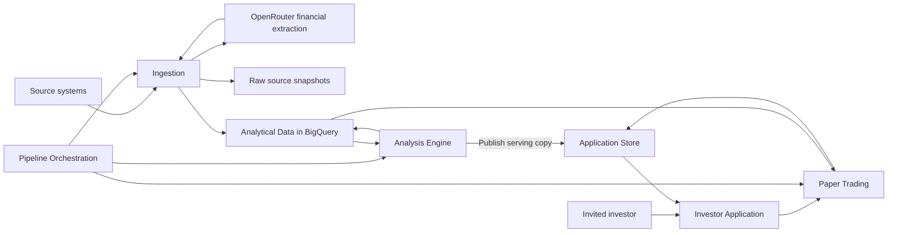

<!-- Public derivative: operational identifiers and private inventory excluded. Normative behavior unchanged. -->

# Gate 2 - Architecture Design

**Status:** FINAL

**Version:** 1.0

**Date:** 2026-09-20

**Input reference:** Tradvisor BRVM - V1 Business Requirements Document, version 1.23 (`tradvisor_brd.md`), supplemented by the architecture discussion

**Author:** Software Architect Agent

## 1. Executive Summary

Tradvisor V1 serves a small invited group with equally important Swing and Long-Term workflows.
Ingestion reuses the production scripts copied into `archive/legacy-ingestion/scripts/`, covering shares, dividends, financials, and ratings.
Daily market signals and Long-Term scores are calculated once and shared across users.
Keep and Sell advice is personalized using a user's paper positions and does not automatically create orders.
BigQuery owns analytical datasets; the confirmed structured Firestore model owns paper orders, balances, and user settings.
The existing Google Cloud infrastructure provides the initial reuse foundation, with scale-to-zero application compute and shared batch calculations as cost priorities.
The confirmed frontend uses Next.js and TypeScript, Tailwind/shadcn, TanStack Table v8, Lightweight Charts, Recharts, and resizable desktop panels.
The approved design is ready for task orchestration; deployment preservation, source verification and release acceptance remain explicit implementation gates.

## 2. Business Context & Drivers

**Approved coverage amendment (2026-09-20):** One year of dividend history is available; further history cannot currently be acquired. Dividend research remains in V1, but full Dividend and Balanced scores, their rankings and recommendations are deferred. This supersedes earlier three-score requirements and implementation notes throughout this architecture. Financial contract v1.1 section 1 is normative. Retain earlier Dividend/Balanced formulas only as future design references, not implementation/backfill/release blockers. Growth requirements are unchanged; missing fiscal years must not be interpolated. A potentially missing fiscal year is unconfirmed in the full dataset.

The Analysis Engine publishes Growth scores only with complete required inputs, and supported dividend facts with coverage metadata. Historical ordinary yield requires a verified complete trailing-12-month window and compatible payment/share/price basis. Investor Application keeps dividend research accessible without suggesting a composite rating or suitability ranking. API/serving contracts expose deferred Dividend/Balanced scores as null with an explicit deferred-scope reason, distinct from missing Growth inputs; no yield-only substitute or automatic future activation. Preserve three-objective identifiers where needed for version compatibility, but do not present Balanced as an active V1 scoring workflow. Tests verify these scope states and that one-year evidence cannot generate multi-year dividend conclusions. Swing and paper trading are unchanged.

Confirmed architecture decisions from the stakeholder discussion:

- V1 access is limited to a small invited group.
- Ingestion is part of the implementation. Reuse `archive/legacy-ingestion/scripts/` and improve it where necessary; the stakeholder confirmed this source location.
- Shared market recommendations cover every stock. Keep and Sell advice depends on a user's paper holdings.
- Both investor workflows remain equally important V1 deliverables.
- All paper orders are user initiated, long-only, and priced at the next trading session's close.
- Real holdings, broker integration, and Coris imports remain outside V1.
- BigQuery views or derived tables are interchangeable implementation options subject to performance and FinOps needs.
- The frontend stack is confirmed: Next.js App Router with React and TypeScript; Tailwind CSS and shadcn/ui; TanStack Table v8; TradingView Lightweight Charts for Swing; Recharts with shadcn chart components for Long-Term and paper performance; and react-resizable-panels through shadcn's Resizable integration. Tremor is not included in V1.
- Financial indicator, scoring, and paper-account calculations remain authoritative on the backend. The frontend displays the published values and explanations.
- Operating cost should be as low as practical. EUR 5/month is an indicative target, not a hard spending ceiling or an instruction to suspend the application.
- Avoid Cloud SQL, self-managed database VMs, and always-on application compute. Interactive compute must scale to zero when idle; scheduled processing runs only when required and terminates afterward.
- Prefer computing shared indicators and scores once per daily publication in BigQuery when SQL is efficient. Compare actual total costs before placing exceptional calculations in short-lived Python jobs; BigQuery is not assumed universally cheaper.
- FastAPI/Python remains the backend direction. The stakeholder confirmed a static Next.js frontend, hosted on Firebase Hosting in the approved deployment baseline. Firebase Authentication is the confirmed identity provider.
- The stakeholder selected option 2, the structured transactional model on Firestore: separate user, portfolio-summary, position, order, execution, and cash-movement records, with atomic updates and resource-oriented REST endpoints. Compact embedded portfolio state and event sourcing were not selected.
- Paper-trading conventions are confirmed: one additional trading session of grace for the original intended closing price, then expiry; explicit fee selection with a submission-time rate snapshot and whole-XOF half-up fee rounding; full rejection of unaffordable orders without partial fills; weighted-average purchase cost with separately allocated purchase fees; and position-level holding/exit references that reset only when the position is fully closed. BRD section 6.3 records the business contract.
- The V1 core technical indicators are EMA 20/50, Wilder RSI 14, Wilder ATR 14, and median traded value over 20 exchange trading sessions. Scored trend confirmation, including the BRD section 6.4 partial-credit formulas and structural guards, is approved as a provisional evaluation baseline. Later app versions may replace the strategy. Other indicator families are deferred; the former breakout/relative-volume rule is not retained. Initialization/warm-up, session handling and factual evidence-status semantics are adopted in `tradvisor_financial_contract.md`. The agreed paper-accounting and position-exit references are unchanged.

The BRD retains its existing IDs. The confirmed distinction between market signals and holding advice refines FR-SW-01 and FR-SW-06: one shared market state is not itself a personalized exit instruction.

Handoff authority: BRD v1.23 and its later approved amendments govern scope; financial contract v1.1 governs calculations; API/data contract v0.13 governs transport and state; integration design v1.0 governs calendar, execution publication and recovery ordering. This final architecture integrates the stakeholder-approved decisions without asserting implementation, empirical effectiveness or release approval. Earlier blanket exclusions of corporate-action/valuation calculations do not exclude the explicitly adopted analytical basis checks and Growth valuation inputs in BRD section 6.6; automated corporate-action processing of paper holdings and real-account reporting remain outside V1. Source mapping v0.5 and the environment assessment are evidence/worklists, not proof of complete coverage. Unverified facts have conservative treatment and validation owners in section 11.

## 3. Requirements Traceability

| Req ID | Requirement | Design decision | Component(s) | Reused/New |
|--------|-------------|-----------------|--------------|------------|
| FR-SW-01 | Daily stock coverage | Shared market state for every stock; separate holding advice when a user owns paper shares | Analysis Engine, Investor Application, Paper Trading | New |
| FR-SW-02 | Insufficient-data state | Explicit unavailable result with reason | Analysis Engine | New |
| FR-SW-03 | Signal strength, evidence status and explanation | Store factual availability, freshness, input basis and rule explanations; no separate probability-like confidence percentage | Analysis Engine, Investor Application | New |
| FR-SW-04 | EMA, RSI, ATR, and traded value | Publish dated, versioned series and explanations with explicit warm-up and actual/estimated turnover semantics | Analytical Data, Analysis Engine | Reused / New |
| FR-SW-05 | V1 trend confirmation, replaceable in future versions | Isolate the selected strategy behind a stable evaluation contract; implement adopted comparisons/thresholds, version parameters and preserve original results | Analysis Engine | New |
| FR-SW-06 | Exit advice | Weighted-average gross entry price for stop loss, highest close since opening for trailing advice, and uninterrupted holding timer until fully sold; no automatic order | Paper Trading | New |
| FR-SW-07 | Historical evidence | Immutable result versions and references to input snapshots | Analytical Data, Analysis Engine | Reused / New |
| FR-PT-01 | Manual orders including Keep override | Authenticated command creates a recommendation-linked pending order; Sell from Keep requires explicit acknowledgment and server-derived advice/override evidence | Paper Trading | New |
| FR-PT-02 | Next-session close and delayed-price grace | Persist intended session; allow one additional session for its price, then expire without later-session substitution | Paper Trading, Pipeline Orchestration | New / Reused |
| FR-PT-03 | Long-only | Enforce nonnegative holdings in a transaction | Paper Trading, Application Store | New |
| FR-PT-04 | XOF, starting cash, fee | Default starting cash 1,000,000 XOF; whole-XOF range 100,000-100,000,000 inclusive at setup/reset only; no top-ups. Explicit fee selection and frozen per-order fees | Paper Trading, Application Store | New |
| FR-PT-05 | Cash and holdings constraints | Reserve and recheck resources; reject unaffordable orders in full and release reservations | Paper Trading, Application Store | New |
| FR-PT-06 | Portfolio reporting | Weighted-average cost, proportional purchase-fee allocation, and separate gross/net realized/unrealized P&L | Paper Trading, Investor Application | New |
| FR-PT-07 | Reset | Reset atomically and fence out jobs targeting the previous simulation | Paper Trading, Application Store | New |
| FR-LT-01 | Growth and dividend research | Growth rankings and dividend facts; Balanced scoring deferred | Investor Application, Analysis Engine | New |
| FR-LT-02 | Growth score, partial coverage and launch review | Keep all catalog companies visible; complete-input Growth scores only, separate partial/unavailable states and independent advice guards. Product-owner review of actual company/sector coverage before launch; no numeric minimum or formula relaxation adopted. Dividend/Balanced scores remain null | Analysis Engine, Investor Application | New |
| FR-LT-03 | Sector-aware Growth scorecard | Preserve full Growth inputs, weights and guards; no missing-year interpolation or dividend proxy score | Analysis Engine | New |
| FR-LT-04 | Score explanation | Persist factor contributions, periods, source links, and alerts | Analysis Engine, Analytical Data | New / Reused |
| FR-LT-05 | Supported measures | Normalize source fields into documented calculation contracts | Ingestion, Analytical Data, Analysis Engine | Reused / New |
| FR-LT-06 | Alerts | Derive alerts alongside Long-Term results | Analysis Engine | New |
| FR-LT-07 | Unavailable companies | Preserve coverage without assigning invented scores | Analysis Engine, Investor Application | New |
| NFR-01 | Market date | Separate observation, trading-session, and publication timestamps | Ingestion, Analysis Engine | Reused / New |
| NFR-02 | Reproducibility | Snapshot inputs and configuration; make retries idempotent | Ingestion, Analysis Engine, Paper Trading | Reused / New |
| NFR-03 | Calculation safety | Automated tests and runtime calculation guards | Ingestion, Analysis Engine | Reused / New |
| NFR-04 | Strategy separation | Separate application workspaces and result types | Investor Application | New |
| NFR-05 | Performance and cost | Batch shared analysis; choose physical BigQuery structures after measurement | Analytical Data, Pipeline Orchestration | Reused |
| NFR-06 | Understandable outputs | Expose explanatory evidence alongside every result | Investor Application, Analysis Engine | New |
| NFR-07 | Pilot capacity and publication targets | Test 25 invited users/5 concurrent sessions, p95 normal reads <=2 seconds excluding cold starts/network, publication <=15 minutes after required inputs ready | Investor Application, Analysis Engine, Pipeline Orchestration | New / Reused |
| NFR-08 | Recovery and best-effort availability | Daily backups retained 7 days; recovery <=24 hours after acknowledgement from latest successful usable backup, no fixed maximum loss; monitor backup age/failures and disclose recovery point; cost validation and reset/access-safe restore drill before release | Application Store, Paper Trading, Pipeline Orchestration | New / Reused |
| NFR-09 | Retention | Apply section 9 lifecycle rules, evidence dependencies, 30-day receipts/logs and reset deletion deadlines | Analytical Data, Analysis Engine, Application Store, Paper Trading | Reused / New |
| NFR-10 | WCAG 2.2 AA target | Complete-workflow automated and manual keyboard/screen-reader checks, accessible chart tables and non-color-only advice | Investor Application | New |
| DR-01 | Five source tables | Establish a source contract for each named BRD table | Ingestion, Analytical Data | Reused |
| DR-02 | BigQuery analytical structures | Preserve the BigQuery platform; physical structure remains selectable | Analytical Data | Reused |
| DR-03 | Tested data assumptions | Fixture-based parser and calculation tests; no data-quality product workflow | Ingestion, Analysis Engine | Reused / New |
| BRD-C-01 | BRD sections 5 and 10: scope exclusions | Application has no real-account, import, broker-execution, or short-selling capability | Investor Application, Paper Trading | New |
| BRD-I-01 | BRD section 9.3: BigQuery integration | Source ingestion and scheduled analytical publication are in scope | Ingestion, Analytical Data, Pipeline Orchestration | Reused |
| BRD-I-02 | Production code: financial extraction provider | Reuse the OpenRouter adapter with recorded extraction artifacts, bounded calls, and protected credentials | Ingestion | Reused |
| BRD-A-01 | Architecture discussion: invited users | Admission control and server-side user ownership checks | Investor Application, Application Store | New |
| BRD-A-02 | Architecture discussion: confirmed frontend stack | Next.js/TypeScript workspaces with shadcn, TanStack Table v8, specialized Swing charts, Recharts, and responsive panel layouts | Investor Application | New |
| BRD-A-03 | Architecture discussion: low cost and scale to zero | No Cloud SQL or database VM; idle application compute scales to zero; shared results are computed in bounded batches and reused | Analytical Data, Pipeline Orchestration, Analysis Engine, Investor Application, Application Store | Reused / New |
| BRD-A-04 | Architecture discussion: structured transactional model | Separate Firestore records, transactional state and ledger updates, paginated history, and resource-oriented REST API | Application Store, Paper Trading, Investor Application | New |
| BRD-A-05 | Architecture discussion: V1 development alignment | Target environment-id-withheld; preserve development ownership and data, use production as read-only functional baseline, review plans before deployment | Ingestion, Analytical Data, Pipeline Orchestration, Investor Application, Application Store | Reused / New |
| BRD-C-02 | BRD sections 9.4 and 10: advisory, privacy and compliance | No guarantee or real execution; product owner obtains applicable legal/privacy/disclaimer and retention review before release | Investor Application, Application Store | New |

BRD-C-01 through BRD-C-02, BRD-I-01 through BRD-I-02, and BRD-A-01 through BRD-A-05 are architecture traceability IDs for previously unnumbered constraints, observed integrations and subsequent stakeholder decisions; they do not replace BRD IDs. BRD objectives OBJ-01 through OBJ-05 map through their section 13 requirement links; nonfunctional targets are in section 9. Business adoption/return/date targets are not invented (ARCH-ASM-10).

## 4. Architecture Overview

Use a Next.js frontend with one FastAPI/Python application backend containing modules for analysis reads, user settings, and paper trading. Run ingestion and daily processing independently from interactive requests. Use the confirmed structured transactional Firestore Native model for application state and compact published serving copies. Use a request-billed Cloud Run API with zero minimum instances and Firebase Authentication with server-enforced admission. The confirmed frontend rendering model is a static Next.js export, using Firebase Hosting in the deployment baseline instead of a request-time frontend server. The frontend never duplicates the analysis engine or paper ledger.



Raw snapshots are owned by Ingestion. Components represent responsibilities, not a requirement for independently deployed services.

## 5. Component Design

### 5.1 Ingestion

- Purpose: acquire, normalize, and load the five BRD data sources while preserving original evidence.
- Reused: the production version of `archive/legacy-ingestion/scripts/`. Adapt the shares, dividends, financials, ratings, PDF extraction, company-list discovery, and common loading functions. Extend company-list discovery into a full company-reference adapter because it does not currently populate `brvm_companies` or provide sector and activity metadata.
- Interfaces and ownership: owns source-specific adapters, raw snapshots, source manifests, and load results.
- Technology: retain Python, pandas, BeautifulSoup, curl-cffi, PDF extraction, and Google Cloud Storage/BigQuery integration patterns. Financial extraction currently calls OpenRouter. Align the selected deployment runtime and dependency versions with CI; runtime compatibility remains implementation verification. Final runtime selection requires deployment compatibility validation.
- Required improvements from inspected code: authoritative session dates; locale-aware numeric parsing; explicit source mappings; loads safe to retry; source snapshots with unique run identifiers; parser tests; HTTP error handling and certificate verification.
- Reuse the existing BigQuery MERGE helper while replacing its shared temporary-table name with a per-run name. Separate PDF acquisition, model extraction, and canonical publication so failures can resume without repeating completed model calls.

### 5.2 Analytical Data

- Purpose: hold company, price, dividend, financial, and rating histories plus published analysis and supporting evidence.
- Reused: BigQuery and the Terraform dataset foundation.
- Interfaces and ownership: owns normalized source contracts, versioned analysis datasets, and published-batch metadata.
- Technology: BigQuery views or derived tables. Prefer persisted, versioned daily results for expensive calculations that must run once, with views where repeated evaluation is inexpensive. Measure cost and latency before choosing each physical structure; a logical view alone does not persist its calculation results.
- Boundary: user cash, orders, and holdings belong to Application Store.

### 5.3 Pipeline Orchestration

- Purpose: coordinate ingestion completion, analysis publication, and pending paper-order processing.
- Reused: the existing Scheduler and Workflows Terraform patterns, adapted to explicit dependencies.
- Interfaces and ownership: owns run identifiers, task status, bounded retries, and publication readiness.
- Technology: reuse the existing Scheduler/Workflows foundation to submit BigQuery jobs and bounded Cloud Run Jobs. Trigger calculation from successful input readiness, not from a separate competing schedule. Retry with a stable session/input/rule identity and publish each successful batch once.
- Cost behavior: jobs terminate after completion. Skip unchanged inputs and completed batches; bounded retries and explicit backfills remain possible. Daily market refresh continues without active users, so zero interactive activity does not mean zero scheduled work or storage charges.
- Boundary: a weekday cron trigger does not prove that a trading session occurred or that closing data is complete.

### 5.4 Analysis Engine

- Purpose: produce shared Swing signals and Long-Term factors, scores, alerts, confidence evidence, and explanations.
- New: no corresponding engine exists in the inspected repository.
- Interfaces and ownership: consumes a named input snapshot and rule version; emits immutable result records and a publication manifest.
- Technology: BigQuery SQL is the default candidate for shared set-based calculations, including traded-value aggregates, true-range inputs, and Long-Term factor/score aggregation. EMA and commonly used RSI/ATR smoothing are recursive; benchmark an exact SQL implementation against a bounded Python batch rather than forcing them into rolling averages. Neither implementation runs historical analysis in the interactive request path. Exact indicator implementations and score formulas require a versioned rule specification.
- Execution and correctness: calculate shared outputs once per completed daily session/input/rule version, not once per user. Reuse unchanged financial factors; refresh price-dependent factors when prices change. Preserve sufficient history or versioned state for rolling and recursive calculations, and recompute the affected range after corrections. Validate any SQL/Python implementations against the same numerical fixtures and warm-up conventions.
- Publication: persist analytical results and evidence in BigQuery, then publish compact immutable serving copies under the same batch ID. Promote the active serving-batch pointer only after all required copies are complete; a failed publication leaves the previous batch active. Serving copies are rebuildable, not a second analytical source of truth.
- Boundary: market Buy conditions are independent of a user's holdings; position exits are evaluated by Paper Trading.

#### Confirmed Core Indicator Contract

The stakeholder delegated remaining financial-rule decisions on 2026-09-19. Financial Calculation Contract v1.1 (companion baseline document), sections 2 and 6, is normative for Swing initialization, session modeling, warm-up, liquidity basis, current-trade eligibility and factual evidence labels. Source availability and empirical evaluation remain implementation/release dependencies, not unresolved strategy choices.

- EMA: confirmed fast period 20 and slow period 50 exchange trading sessions, consuming dated closes. EMA 20 is the price-extension reference. Publish both series, configured periods, and initialization/warm-up conventions; use SMA seeds and the contract's 250-session actionable warm-up.
- RSI: confirmed 14 sessions with Wilder smoothing; consumes close-to-close changes under the explicit session/missing-price policy. Publish the period, smoothing/initialization method, and momentum interpretation. Use RSI 100 for gain-only, 0 for loss-only and 50 for both averages zero, with Wilder seeding/recursion per the normative contract; missing inputs are not a neutral reading.
- ATR: confirmed 14 sessions with Wilder smoothing; consumes session high, low, and previous close. True range is `max(high - low, abs(high - previous_close), abs(low - previous_close))`; publish the smoothing and period. It expresses volatility, not direction. Do not replace missing high/low values with the close and label that result ATR. Adding ATR does not authorize ATR-multiple exit rules.
- Traded value: confirmed eligibility requires median >= 5,000,000 XOF over 20 exchange sessions and trading in at least 18 of those sessions. Include confirmed zero-turnover sessions; never treat missing values as zero. Publish the activity count alongside the median. Prefer authoritative source-reported turnover in XOF if available. The inspected share adapter does not establish that field's availability; `close * volume` may be offered only as an explicitly labeled estimate. Publish basis, source, window, and availability; never mix actual and estimated values under one unlabeled series.
- Session and warm-up contract: do not use calendar-day windows or silently compress windows to sessions with trades. Apply the normative contract's confirmed no-trade analytical carry/explicit zero-range model, independent unknown-input interruptions, exact seeds and 250-session warm-up. Never manufacture source OHLC; label modeled ATR inputs. Buy additionally requires a genuine current-session trade/close and no active suspension. A nominal period is not the complete history-fetch requirement. Test these conventions across SQL/Python implementations; low ATR never bypasses liquidity eligibility. Approved periods are a baseline for historical holdout evaluation including fees and execution limitations, not evidence of investment effectiveness.
- Scope: standalone SMA, Bollinger Bands, MACD, and other new indicator families are deferred. Raw candlestick/volume data remains available as chart context and calculation input. Internal arithmetic used to initialize a selected indicator is not an additional user-facing indicator family.
- Calculation placement: preserve a common versioned formula contract across SQL and Python, including history seeds and correction replay. Published results are reused across users. Final execution-engine selection depends on correctness and measured total cost, not the assumption that SQL is always cheaper.
- Recommendation/scoring: implement the approved BRD section 6.4 evaluation baseline, with EMA alignment/direction 20+20 points, RSI 30, extension 30, and inclusive minimum unrounded Buy score 70. Required inputs must be valid and available, including strictly positive ATR14; otherwise publish an unavailable score without reweighting. Keep liquidity and structural guards separate from the total. Not qualifying for Buy does not imply Sell; personalized exits remain separate. Display signal strength, not a calibrated return probability. Use factual calculation status, dated freshness and basis flags from the normative contract, not another confidence percentage.
- Contribution contract: let `A = ATR14(t)`, `g = (EMA20(t) - EMA50(t)) / A`, `s = (EMA20(t) - EMA20(t-5)) / A`, `e = (close(t) - EMA20(t)) / A`, and `clamp(x) = min(1, max(0, x))`. Alignment is `20 * clamp(g)`; direction is `20 * clamp(s / 0.5)`. RSI uses linear interpolation through `(40,0), (50,15), (55,30), (65,30), (70,15), (80,0)`, with zero outside these endpoints for valid RSI values. Extension is zero below 0, 30 from 0 through 1, `15 * (3-e)` between 1 and 3, and zero at/above 3. All terms use the same dated snapshot; `t-5` is five exchange sessions earlier.
- Eligibility contract: Buy requires unrounded score >=70, approved liquidity thresholds, `EMA20(t) > EMA50(t)`, `close(t) >= EMA20(t)`, `EMA20(t) > EMA20(t-5)`, and `e < 3`. The last two guards close the declining-trend and overextension loopholes identified in the financial review. Publish the score when assessable even if a guard fails, with explicit non-Buy eligibility and reasons.
- Score presentation: publish total, individual contributions, active threshold, guard evidence, eligibility reasons, and immutable rule/configuration reference. Display one decimal place; threshold comparison uses the unrounded total and display rounding cannot promote eligibility. Keep scored trend confirmation inside the existing strategy interface, with no extra service or V1 strategy selector.
- Evaluation status: these stakeholder-approved reference points remain empirically provisional. RSI and extension may penalize the same move; compare a gentler high-RSI penalty offline without introducing another live strategy. ATR normalization affects both EMA terms as well as extension, so up to 70 points depend on ATR; do not describe the components as independent evidence. Evaluate denominator sensitivity, subsequent returns, drawdowns, turnover, and fee-adjusted results with the approved execution timing and limitations. Unit correctness is not investment validation.

#### Confirmed Long-Term Scorecard

**V1 scope rule:** Only Growth scoring and supported dividend research are implemented. All Dividend/Balanced formulas, multi-year dividend history, objective blends and their numerical fixtures retained below are future-version references only: do not create V1 implementation or acquisition tasks for them. V1 tests instead require null deferred scores and no dividend/balanced suitability rankings. No automatic activation is allowed when additional data arrives.

Financial Calculation Contract v1.1 (companion baseline document), sections 1-5, completes the Long-Term rule baseline under stakeholder delegation. Implement the in-scope rules in the existing Analysis Engine with immutable configuration, not additional services. Profitability uses 10/5/10 latest ROE/median normalized ROE/profitable-year allocations; non-financial resilience uses 12/8 net-debt-equity/current-ratio allocations while bank/insurer resilience uses required regulatory coverage; valuation uses 15/10 earnings-yield/guarded-PB allocations. Preserve the approved 30-point Growth formulas. Deferred Dividend formulas remain reference material only.

Long-Term candidate/watchlist/low-score bands are >=70, >=50 to <70, and <50 on the unrounded objective rating, conditional on separate guards. Review-required and insufficient-evidence states retain assessable scores. Annual financial freshness is 18 months; price advice requires an actual traded close aged at most five exchange sessions. No probability-like confidence score or automatic Long-Term liquidation instruction is introduced.

The contract requires source extensions for matched ordinary-owner earnings/equity, an opening equity observation, current assets/liabilities, unrestricted cash, matching capitalization/share counts, complete ordinary paid-dividend attribution, insurer activity and financial-sector capital coverage. Existing scripts do not prove these fields exist. Missing required values block only dependent scores/advice, never trigger substitute formulas. Formula adoption is complete; source verification and effectiveness evaluation are not.

- Selected approach: Option 2, a sector-aware scorecard with fixed, versioned rules for financially meaningful categories, initially banks, insurers and non-financial companies. Implement within the existing Analysis Engine, not separate services or a model per industry. Category/metric definitions and required input contracts are adopted in `tradvisor_financial_contract.md`; verified issuer mappings and source coverage remain delivery dependencies.
- Growth score dimensions: multi-year revenue/earnings growth, profitability and consistency, sector-appropriate resilience, and valuation at the current price. Growth denotes capital-growth attractiveness rather than historical growth alone. Dividend score dimensions: ordinary-payment regularity, maintenance/growth, earnings coverage/payout sustainability and ordinary yield at the current price.
- Publish both 0-100 component scores, category, factor contributions, source periods, price date and immutable rule/configuration references. Objective selection changes the weighted overall rating/advice, not the underlying component scores. Balanced-quality dimension weights, mixed-horizon history, distinct-objective blends, the 12/18 revenue/net-income growth allocation and its balanced bands/earnings exceptions are approved; remaining dimension formulas, normalization bands and advice guards are adopted in the normative financial calculation contract. No return forecast or calibrated probability is implied.
- Confirmed objective contract: for company scores `G` and `D` from the same input snapshot and rule version, capital-growth overall is `G` (100/0), dividend-income overall is `D` (0/100), and balanced overall is `(G+D)/2` (50/50). These weights describe ratings, not portfolio allocation. Keep both components/evidence visible, with unavailable states rather than zero substitution or fallback to another score. A required missing component prevents the dependent overall calculation. Publish objective-specific advisory eligibility separately; numerical averaging never bypasses risk guards, as defined in financial calculation contract section 5.
- Objective fixtures: G=85 and D=25 produces 85, 25 and 55 for growth, dividend and balanced respectively. Verify component invariance across objectives, same-version/snapshot inputs, bounds, and unavailable-component propagation without reweighting. A low Dividend score does not penalize the capital-growth rating. Preserve immutable objective-weight configuration for historical reproducibility.
- Confirmed dimension maxima: Growth = growth 30, profitability/consistency 25, resilience 20, valuation 25; Dividend = ordinary-payment regularity 25, maintenance/growth 15, earnings coverage/payout sustainability 40, ordinary yield 20. Each score has 100 possible points. Keep these dimension maxima common across categories, with sector-appropriate underlying measures/bands. Version the configuration; these weights are an evaluation baseline, not empirically optimized BRVM settings.
- Confirmed growth allocation: Option 2 assigns 12 points to three-year revenue CAGR and 18 to three-year company net-income CAGR: `12 * revenue_growth_factor + 18 * earnings_growth_factor`, with each factor in 0-1 under the confirmed bands below. Latest annual changes supply context and deterioration alerts, not a separate numerical bonus or penalty in this dimension; sustained profitability belongs to the existing profitability/consistency dimension. Label net-income growth explicitly, not EPS growth or dilution-adjusted growth. Preserve sector-appropriate revenue semantics, using the normative category mappings; verified issuer/source integration remains outstanding. Known losses are evidence, not missing inputs; negative-base recoveries must not produce ordinary percentage growth. Qualify tiny-base and exceptional-earnings distortions without inventing adjusted earnings. The 12/18 split is an evaluation baseline, not empirical calibration; equal 15/15 and separately scored latest-year momentum alternatives were not selected.
- Confirmed balanced growth bands: for comparable positive endpoints, `CAGR = (latest / value_three_fiscal_years_earlier)^(1/3) - 1`. Revenue factor is `clamp(revenue_CAGR / 0.15, 0, 1)`; earnings factor is `clamp(net_income_CAGR / 0.20, 0, 1)`, subject to earnings exceptions. Rates use decimal units. Nonpositive CAGR earns zero; credit grows continuously to full contribution at 15% revenue and 20% earnings CAGR and is capped thereafter. Alternative full-credit thresholds 10%/15% and 20%/30% were not selected. Version these provisional evaluation settings; sector applicability requires validation, not an assumption that revenue measures are interchangeable or these thresholds empirically optimal.
- Confirmed earnings exceptions: with required history present, latest net income <=0 earns zero earnings-growth points with loss/break-even explanation; starting net income <=0 and latest >0 earns zero with recovery explanation. Neither case displays ordinary CAGR; zero points are explicit policy, not missing-data imputation. Positive endpoints with intervening losses retain endpoint CAGR and an interrupted-profit-history flag, leaving consistency scoring in its own dimension. Nonpositive activity endpoint treatment is explicitly defined in financial calculation contract section 3.1; unknown values remain unavailable, not policy zeros.
- Confirmed small-base warning: for positive starting net income, flag `starting_net_income < 0.10 * median(abs(net_income_year))` over all five annual observations, including confirmed zeros. Equality does not flag; a zero median cannot trigger for a positive starting value. Retain the capped growth formula, with no extra adjustment; warnings/caps do not remove denominator distortion. Preserve exceptional-item qualifications without fabricating adjusted earnings. Missing required history keeps the dependent score unavailable, never zero-filled or reweighted.
- Growth allocation fixtures: normalized factors `(0,0)`, `(1,0)`, `(0,1)`, `(1,1)` contribute 0, 12, 18 and 30 respectively. Actual CAGR pairs 7.5%/10% and 15%/20% contribute 15 and 30 points; higher rates remain capped. Cover zero/negative CAGR with positive endpoints, latest losses/break-even, nonpositive-base recoveries, intervening losses, strict small-base threshold/equality, zero median, missing history and unchanged points when only latest-year alerts change. These synthetic checks do not establish investment effectiveness.
- Confirmed history contract: require five completed fiscal years of relevant records. Three-year revenue/earnings CAGR uses four annual observations; expose latest annual change and use the fifth year for consistency. Profitability uses five-year consistency plus latest-year position; resilience uses the latest reported balance sheet with historical trend context. Dividend history covers five fiscal years; calculate three-year dividend growth only where meaningful, and coverage for the latest matched fiscal year plus two preceding years. Use the adopted within-dimension aggregation in financial calculation contract sections 3-4. Do not substitute a shorter window for missing required history or silently redistribute weights. Confirmed zeros/losses are evidence, not missing observations.
- Dividend-date contract: historical yield uses ordinary dividends actually paid over trailing 12 months divided by the latest valid close, with explicit payment-date and price-date evidence and compatible per-share units. Exclude exceptional distributions from recurring yield. Fiscal-year payout coverage instead matches the dividend's relevant earnings year, without inferring a universal payment-year-minus-one relationship. Preserve both date meanings. Required share-count/EPS/total-dividend inputs, corporate-action basis and source history must be verified before calculating supported metrics.
- History tests: cover five-year eligibility versus incomplete records, four annual observations for three-year CAGR, latest-year deterioration despite positive multi-year growth, losses/recoveries, confirmed zero versus missing dividends, exceptional payments, payout fiscal-year alignment versus trailing payment dates, and price/share-unit compatibility. Missing history keeps companies visible with unavailable scores. Numerical scoring fixtures are defined in the financial calculation contract; history checks do not establish investment effectiveness.
- Financial semantics: bank deposits and insurance liabilities cannot be scored as industrial net debt. Handle loss-to-profit transitions as recovery rather than conventional negative-base growth. Separate ordinary and exceptional dividends for recurring-income analysis. High yield cannot alone establish attractiveness; apply the adopted risk/eligibility guards in financial calculation contract section 5. Ratings and other available context remain explainable evidence, not implicitly assigned new weights.
- Input dependencies: the five-field financial extraction does not establish share counts/EPS, total dividends, operating cash flows or regulatory capital. Verify compatible periods, units and ownership basis before P/E, P/B or payout calculations; never divide per-share dividends by company-wide income. Missing required inputs result in explicit unavailability, not dynamic weight redistribution. Do not silently substitute unrelated industrial metrics for missing bank/insurer measures. Reuse existing extraction paths where adequate; implement obtainable missing-field acquisition under MAP-01 through MAP-10, with dependent outputs unavailable until verified.
- Validation contract: test sector applicability, unsupported/unknown category handling, nonpositive growth bases and denominators, exceptional dividends, units and source-period alignment, missing mandatory inputs, contribution totals and objective invariance of component scores. Use the normative contract's adopted formulas and expected numerical fixtures; extend tests across every boundary and missing-input path. Financial effectiveness evaluation is distinct from calculation tests; no separate data-quality UI is introduced.

#### Strategy Evolution

- Keep strategy evaluation inside the Analysis Engine, separate from indicator calculation, publication, API presentation, and paper-order accounting. Use a small evaluation interface consuming a versioned indicator/input snapshot and immutable configuration, returning market state, condition-level evidence, availability reasons, and confidence evidence. No separate service or dynamic plugin framework is needed.
- V1 implements only `trend_confirmation`, with one active configuration for each published batch. Pullback and weighted-score alternatives are deferred, not additional V1 implementations or user-facing strategy selectors.
- Persist `strategy_id`, `rule_version`, and an immutable configuration reference with each analytical batch and expose strategy identity with recommendation evidence. Calculation identity includes the input snapshot, session, strategy, and rule/configuration version. Retain versioned definitions and implementation references sufficient to reproduce historical results.
- A future strategy is a new implementation of the same evaluation contract. Activate changes at a complete batch publication boundary; do not mix strategy versions within one batch or overwrite historical evidence. Orders retain their originating recommendation reference; a later strategy activation does not silently reprice, cancel, or reinterpret accepted orders or reset holdings. Any change to exit policy requires a separate explicit migration decision.
- Contract tests cover deterministic scoring, interpolation endpoints/interiors, score bounds and contribution totals, unrounded minimum-score boundaries, liquidity gates, structural guard boundaries, missing mandatory inputs, zero/negative ATR, historical version preservation, and strategy changes across publication boundaries. Explicit fixtures reject a flat/falling EMA20 despite a theoretical 20+0+30+30=80 score and an extension >=3 ATR despite a 20+20+30+0=70 score. A score exactly 70 qualifies only when every guard passes. These synthetic boundary fixtures do not establish realizable market performance. This is an extension of the existing Analysis Engine, not a new component.

Indicator references: [EMA](https://www.fidelity.com/learning-center/trading-investing/technical-analysis/technical-indicator-guide/ema), [RSI](https://www.fidelity.com/learning-center/trading-investing/technical-analysis/technical-indicator-guide/RSI), and [ATR](https://www.fidelity.com/learning-center/trading-investing/technical-analysis/technical-indicator-guide/atr). These explain indicator definitions and limitations; they do not validate a Tradvisor strategy or select its parameters.

### 5.5 Investor Application

- Purpose: serve invited users with separate Swing, Long-Term, and paper-portfolio views.
- New: README confirms the previous Streamlit application was removed.
- Interfaces and ownership: authenticated analysis reads, objective preferences, order submission, and reset requests. The backend determines user identity.
- Technology: confirmed Next.js App Router, React, and TypeScript frontend with static export; FastAPI/Python backend direction. The deployment baseline uses Firebase Hosting for the static frontend and uses request-billed Cloud Run for the API, with zero minimum instances. Firestore is selected; Firebase Authentication is confirmed for email/password sign-in, verified email and password reset with backend-enforced manual allowlist admission. Static export replaces the earlier request-time server-rendering proposal without changing the selected UI libraries.
- Boundary: users cannot select another user's portfolio by changing a request identifier.

#### Confirmed Frontend Stack

| Concern | Selected technology | Responsibility |
|---------|---------------------|----------------|
| Framework | Next.js App Router, React, TypeScript | Routes and interactive client components; confirmed static shell with authenticated API reads |
| Styling and primitives | Tailwind CSS and shadcn/ui | Shared dark-theme tokens, tabs, sheets, badges, forms, dialogs, and tables |
| Tables | TanStack Table v8 | Sorting, filtering, selection, and column state for screeners and paper records |
| Swing charts | TradingView Lightweight Charts | Candlesticks, volume, and display of backend-provided indicator series |
| Research and performance charts | Recharts with shadcn chart components | Score contributions, dividend history, and simulated equity/P&L series |
| Desktop layout | react-resizable-panels through shadcn Resizable | Adjustable list, chart, and detail panes |

Use Recharts directly with shadcn's chart utilities; adding Tremor would introduce another component layer for the same V1 chart needs. These libraries are selected dependencies for a new frontend, not existing repository assets.

#### Rendering and Interaction Boundaries

- Confirmed rendering model: generate a static application shell at build time and use authenticated client requests for live and user-specific data. Do not embed private data at build time. This replaces the earlier request-time Server Component reads; do not use Server Actions or other request-time Next.js server features. Use Client Components for interactive tables, charts, panel resizing, and paper-order forms.
- Keep user-specific routes as static workspaces that load authorized data at runtime. Prebuild known stock-detail paths or use a static detail route with a symbol parameter; do not depend on runtime generation of unknown paths. Verify direct navigation and refresh against the exported files and hosting configuration.
- The static shell is publicly downloadable; invitation-only protection applies to all API data and commands. A client-side login gate is navigation behavior, not an authorization boundary. Live market updates do not require a frontend rebuild.
- Initialize Lightweight Charts in the browser after its container exists; a Client Component declaration alone does not eliminate Next.js prerendering. Isolate browser-only initialization, release chart resources on unmount, and resize charts when their panels change size.
- Lazy-load chart-heavy stock detail where appropriate. Preserve date alignment between candle, volume, and indicator series, and show missing observations without fabricating prices.
- Display the configured EMA as a price overlay, RSI and ATR in appropriately scaled panels, and traded value as an XOF activity series or detail. Include each indicator's value, period, definition, and interpretation; distinguish estimated traded value from source turnover. These are the only V1 core indicator families.
- Keep indicator values, score contributions, fee amounts, cash, and P&L authoritative on the backend. Frontend formatting and chart scaling do not redefine financial calculations.
- Keep shared market results separate from per-user holding advice in both the response contract and UI. Show the analysis date and recommendation evidence in the stock detail.
- After a successful order or reset command, refresh the affected paper state from the backend. Pending orders must never be displayed as completed fills optimistically.
- Keep authenticated user state out of shared caches. The browser must not receive infrastructure credentials or call analytical storage directly.

#### Layout and Accessibility

- Swing desktop view combines a stock table, price/volume chart, and recommendation detail with resizable panes.
- Long-Term view combines objective selection, ranking, and company factor detail using the same table and theme conventions.
- Paper-portfolio view exposes balances, pending orders, positions, and simulated performance without implying real brokerage holdings.
- On narrow screens, use stacked content or tabs instead of requiring side-by-side resizable panes. Set minimum chart dimensions and constrain table overflow within its workspace.
- Preserve keyboard focus through stock selection, drawers, and order confirmation. Expose chart values and factor contributions as readable text or tables, and include explicit recommendation labels rather than relying on color.

#### Compatibility and Verification

Pin TanStack Table to the selected v8 major and implement against its v8 APIs. The current shadcn Data Table guide uses v9 APIs, so generated or copied examples must be adapted rather than assumed compatible. Pin a tested set of Next.js, React, shadcn primitive, Recharts, and resizable-panel dependencies in the lockfile during implementation.

Acceptance checks cover desktop/mobile navigation, keyboard flows, panel/chart resizing, browser-only chart initialization, empty/unavailable results, theme contrast, and pending-order/reset refresh. Add the attribution notice and TradingView link required by Lightweight Charts.

Official references checked during stack selection: [Next.js Server and Client Components](https://nextjs.org/docs/app/getting-started/server-and-client-components), [shadcn Data Table](https://ui.shadcn.com/docs/components/data-table), [shadcn Chart](https://ui.shadcn.com/docs/components/chart), [shadcn Resizable](https://ui.shadcn.com/docs/components/aria/resizable), and [Lightweight Charts](https://tradingview.github.io/lightweight-charts/docs).

### 5.6 Paper Trading

- Purpose: accept manual orders, enforce cash and holding limits, execute eligible orders, calculate P&L, and generate personalized holding advice.
- New: the inspected repository contains no retained transactional paper-trading implementation.
- Interfaces and ownership: owns order and execution rules, fee calculations, position state, and reset behavior.
- Technology: a module within the application backend plus a scheduled execution entry point; use database transactions for balance changes.
- Boundary: balanced stop, activated trailing, technical-deterioration and duration conditions create personalized advice only. They never initiate a sell order. Shared technical inputs are produced once by the Analysis Engine; Paper Trading combines them with position state, rather than recalculating indicators per user.

### 5.7 Application Store

- Purpose: persist user admission, preferences, virtual cash, paper orders, executions, and positions.
- New: no inspected implementation supplies the V1 transactional paper ledger. Existing application data is not this ledger and must be preserved; no identity/data migration is implied.
- Interfaces and ownership: owns atomic updates, application-enforced idempotency, simulation generation, per-user data ownership, and rebuildable serving copies of published analysis.
- Technology: confirmed structured transactional model using Firestore Standard in Native mode, the eligible default database, and Python server SDK. This replaces the relational-store proposal; Cloud SQL and database VMs are excluded by the stakeholder. Use multi-document transactions and stable document identities for order/ledger consistency. Do not use SQLAlchemy or Alembic for Firestore; version document schemas and migration routines explicitly.
- State model: keep current cash and per-symbol positions ready to read. Commit execution and cash-movement records alongside those updates for reconciliation; do not reconstruct every interactive response by replaying an event stream. Collection layout and transaction contracts are specified in section 7.
- Constraints: no implicit relational joins or database foreign-key constraints. Enforce references and ownership in backend code. Represent money as documented fixed-point integers, not floating-point values. Deny direct browser database access; the backend enforces invitation and per-user access using its verified identity context.

## 6. Reuse Inventory

Reuse the existing Python source adapters, financial PDF extraction and loading stages,
company discovery/mapping, BigQuery load helpers, Terraform foundation and CI workflow.
These are reuse candidates, not certified live services. Adapt source-specific contracts,
retry-safe loading, immutable evidence and explicit pipeline dependencies.

Detailed environment inventory, state addresses, identities and observed security findings
remain in restricted operator evidence and are intentionally not published here.
Before deployment, verify current ownership and preserve existing development resources.
Production is a read-only functional reference, not a configuration/state/data clone.


## 7. Data Architecture

Source-To-Calculation Mapping v0.5 (companion baseline document) maps the five supplied schemas and two read-only CSV samples to Swing, paper, Growth and dividend-research dependencies. It distinguishes field presence from verified semantics/coverage, identifies derivations and missing inputs, and provides MAP-01 through MAP-10 adapter work with two grouped source-confirmation questions. The source-mapping pass did not query production rows; later environment checks inspected metadata and selected schemas; a targeted scraper read confirmed runtime-date assignment, distinct from the stakeholder's intended trading-date meaning. This is a reviewed-document integration aid, not certification of production coverage or a change to the financial rules.

Analytical data includes source identity, collection time, effective market or fiscal period, source snapshot reference, and revision. Daily results additionally record rule version and analysis batch. Corrections produce a new revision rather than silently changing a published historical recommendation.

Normalize each production adapter into documented BRD-facing contracts. Shares and financials use lowercase names; dividends still emit uppercase fields while their loader expects lowercase names. Inspect actual BigQuery schemas before migration rather than assuming producer and consumer contracts already match.

For each ingestion run, record source, run ID, collection timestamp, covered period, parser version, raw snapshot URI and hash, row count, and load/publication outcome. A committed load is distinct from an attempted scrape. Replay uses the stored source evidence rather than a fresh request to the source website.

Share history is keyed by symbol and trading-session date. Dividend history requires a stable distribution identity that preserves separate installments for the same fiscal year; its exact natural key depends on source evidence. Financials retain source-report revisions alongside the current symbol/year result. Ratings retain observed/effective dates, agency where available, original rating text, and mapped scale instead of relying only on a year for downgrade history.

An extraction artifact records the PDF hash and storage reference, source publication date, extractor/prompt version, actual model identifier, provider response, and accepted normalized fields. The analytical snapshot references this artifact. The reproducibility contract begins with the persisted extraction result: rerunning a probabilistic model is not assumed to reproduce its earlier output. Ingestion must preserve available publication dates to avoid treating later financial information as known at an earlier analysis date.

Application data includes invited-user identity, investment objective, paper-portfolio settings, simulation generation, pending orders, executions, fee amounts, cash movements, and holdings. Store monetary values with exact decimal or fixed-point semantics.

### Structured Firestore Model

The following physical layout implements the confirmed option 2. Field names are engineering defaults, not existing deployed data. API And Data Contract v0.13 (companion baseline document) specifies logical fields and the approved technical baseline for exact-money semantics, resource limits and command behavior; it does not claim these schemas are implemented.

| Document path | Responsibility / principal fields |
|---------------|-----------------------------------|
| `users/{uid}` | Investment objective and preference version; identity comes from verified authentication, never a caller-supplied UID; authoritative allowlist membership is separate and admin-only |
| `paper_portfolios/{uid}` | One portfolio control record per user: active generation, configured fee rate, schema version, update timestamp |
| `paper_portfolios/{uid}/generations/{generation}` | Current summary: starting cash, cash balance, reserved cash, pending-order count, state version, creation timestamp |
| `.../generations/{generation}/positions/{symbol}` | Quantity, reserved sell quantity, remaining gross purchase cost, unallocated purchase fees, opening session, highest valid close since opening and its evaluated-through session |
| `.../generations/{generation}/orders/{order_id}` | Symbol, side, quantity, recommendation and analysis references, accepted timestamp, intended session, grace deadline, fee snapshot, reservation, status, terminal reason |
| `.../generations/{generation}/executions/{order_id}` | At most one full execution per order: price, quantity, gross amount, fee, allocated purchase cost/fees for a sell, net cash effect, intended session, processed timestamp, source revision |
| `.../generations/{generation}/cash_movements/{movement_id}` | Opening balance and trade cash movements; stable IDs, signed amount, execution reference where applicable, timestamp |
| `paper_portfolios/{uid}/command_receipts/{receipt_id}` | Idempotency record scoped to user, command, key, and expected generation; payload fingerprint and minimal committed outcome |
| `analysis_batches/{batch_id}` and bounded child collections | Rebuildable published Swing, Long-Term, and chart-serving records, keyed by symbol and bounded series chunk |
| `publication_state/current` | Active complete analysis batch and publication metadata |

The ellipsis in paths expands to `paper_portfolios/{uid}`. Histories and chart series are separate documents, never indefinitely growing arrays. Per-record schema versions support explicit migrations. Keep operational fields needed for scheduled pending-order selection on the order documents and define only the indexes required by actual queries, including collection-group selection by status and intended session.

Persist money as checked signed 64-bit millionths of XOF, using arbitrary-precision intermediates and rejecting overflow or unsupported source precision. Serialize six-decimal strings plus currency in JSON. Round executed fees once to whole XOF half-up; allocate partial-sale costs/fees half-up to the internal unit, consuming all residuals on final sale. API/data contract section 2 fixes these engineering defaults and limits; generating schemas and boundary tests is implementation work, not an unresolved money-policy choice.

### Confirmed Calculation Rules

- Manual Sell override (approved 2026-09-20): users may sell held shares from Keep as well as Sell advice. Keep requires explicit acknowledgment with the current advice visible. Persist the validated advice action/reference, evaluation session, exit policy and generation/state version plus override evidence at acceptance. Do not change the analytical recommendation. Ownership, available shares, reservations, fees and next-session execution remain mandatory. Already accepted override orders do not depend on a later Sell signal. Missing or stale advice cannot authorize an override.
- Recommendation freshness (approved 2026-09-20): new orders require current advice evaluated for the latest completed authoritative exchange session at acceptance, not simply the latest available batch. Reject stale references with a refresh-and-reconfirm response. Dated results remain readable during source delays, but outdated advice blocks new orders. Already accepted orders retain their original execution and expiry rules through batch or signal changes. Validate personalized Sell/Keep advice against the current position, generation and state; Keep still requires explicit override acknowledgment.

- Starting cash (approved 2026-09-20): prefill 1,000,000 XOF at initial setup; accept whole-XOF amounts from 100,000 to 100,000,000 inclusive at setup or confirmed reset. Validate server-side before any generation/state change; reject fractional and out-of-range amounts without partial writes. Preserve the existing exact-money JSON representation. Store the selected starting cash immutably per generation and initialize cash to that amount. No active-simulation funding/top-up endpoint or preference edit may alter it. These limits do not cap subsequent trading balances. Reset uses the existing idempotency and generation-fencing contract. Test minimum/default/maximum, adjacent invalid bounds, fractional input, mutation attempts, and reset/retry behavior.

- Require explicit nonnegative fee-rate selection at setup; zero is allowed without being silently preselected. Snapshot the rate on order acceptance. For either side, `fee = round_half_up(quantity * closing_price * rate / 100, whole_XOF)`. Charge only on execution. Later fee changes affect new orders, not pending orders or history.
- For a position with quantity `Q`, remaining gross purchase cost `C`, and remaining purchase fees `F`, the gross average entry price is `C / Q` and fee-inclusive basis is `C + F`. Buying `q` at price `p` with fee `f` changes these totals to `Q + q`, `C + q*p`, and `F + f`.
- Selling `q` allocates `C*q/Q` of gross purchase cost and `F*q/Q` of purchase fees. Gross realized P&L is `q*p - allocated_cost`; net realized P&L subtracts the allocated purchase fees and actual sell fee. Subtract the allocated quantities/costs/fees from the position; on the final sale allocate all remaining residuals and clear the position's holding references.
- With a valid valuation price `v`, gross unrealized P&L is `Q*v - C` and net unrealized P&L is `Q*v - C - F`. Do not subtract a hypothetical future sell fee or double-count purchase fees already allocated to closed shares. Mark valuation freshness explicitly when the latest close is unavailable.
- Holding duration begins at the intended execution session of the opening buy and continues through additional buys and partial sells. Stop-loss advice uses `E = C / Q` excluding fees. Trailing-stop advice uses `H`, the highest valid daily close from the opening session onward, without resetting after an additional buy or partial sale. A fully closed then reopened position starts a new period and high-water reference. The balanced V1 exit baseline is approved for evaluation; no alert creates an order.
- Balanced exit contract: at daily close `P`, loss advice triggers at `P <= 0.95 * E`; trailing protection activates when a close reaches `P >= 1.08 * E`, with activated trailing advice at `P <= 0.96 * H`. Technical exit is `(P(t) < EMA20(t) AND P(t-1) < EMA20(t-1) AND RSI14(t) < 45) OR EMA20(t) <= EMA50(t)`. Here `t-1` is the preceding exchange session, not the last available stock observation. Maximum holding duration is 30 exchange sessions. Any established trigger produces Sell with all triggered reasons; technical confirmation does not defer another trigger.
- Holding-advice availability: Keep requires all applicable exit checks to be assessable and none triggered. If no exit can be established but a required check is unavailable, publish unavailable checks instead of Keep. Preserve any independently established Sell reason when another check is unavailable. Buy score below 70, entry overextension, or failed Buy liquidity eligibility alone does not trigger Sell. Do not derive Sell strength by complementing the Buy score.
- Confirmed activation state: persist whether trailing protection has activated and the activation session/evidence. Once active it stays active until full closure or portfolio reset, including after additional buys and partial sells. Before activation, compare each new valid session close with `1.08 * E` for that session; do not apply a revised entry retrospectively to an old high. Preserve `H` independently. An already active position with `H=1,150` retains its 1,104 trailing level when an additional buy raises `E` to 1,100. Session-ordered processing and retries must preserve the activation event, using historical position state rather than a later entry balance.
- Confirmed duration contract: elapsed sessions are the authoritative exchange-session index difference from the intended execution session of the opening buy. Opening session is 0, the next is 1; duration advice applies at each session close with elapsed sessions >=30 while still open. Exchange holidays/weekends are excluded, but stock non-trading and missing prices do not pause the timer. Delayed execution processing does not shift the opening reference. An order manually submitted after the session-30 alert targets session 31's close; this is an advice deadline, not automatic liquidation.
- Confirmed exit-policy versioning: assign an immutable exit-rule/configuration reference when a position opens and retain it through additional buys and partial sells until fully closed. Newly opened positions use the then-active exit policy; do not silently migrate existing positions. Retain evaluators/configurations needed by open positions and historical results, including their indicator definitions/input requirements if future strategies change. Fully closing/reopening establishes fresh policy, activation, high-water and timing state. Portfolio reset remains generation-fenced and clears the prior simulation.
- Exit validation: cover equality at 95% entry, 108% activation and 96% high-water levels; RSI exactly 45; EMA20 equal to EMA50; consecutive-session comparisons with missing observations; simultaneous triggers; partially unavailable checks; entry changes; partial sells; reset fencing; and close/reopen behavior. With unchanged entry 1,000, expected levels are loss 950, activation 1,080 and trailing 1,104 after a high close of 1,150. Test persistent activation after entry rises, no retroactive activation using old highs, session 0/29/30/31 boundaries, holiday and missing-price counting, late processing, retry idempotency, and old-policy retention versus new-position policy assignment. Separately evaluate turnover, drawdowns and fee-adjusted outcomes under manual next-session-close execution. Fixed percentages are not volatility-adjusted or guaranteed loss limits; ATR-distance analysis does not introduce ATR-based exits.
- Calculation fixture: buy 10 shares at 1,000 XOF with a 100 XOF fee, then 10 at 1,200 with a 120 fee. Gross average entry is 1,100. Sell 5 at 1,300 with a 65 fee: allocated cost is 5,500, allocated purchase fee is 55, gross realized P&L is 1,000, and net realized P&L is 880 XOF. Remaining gross cost is 16,500 and purchase fees are 165 for 15 shares.

### Transaction Boundaries

- Order acceptance: verify admission and ownership; transactionally read the portfolio control, active generation, affected position when relevant, and command receipt. Validate the recommendation reference and request fingerprint, reserve cash or shares, create the pending order, update the summary/version, and write the receipt together. Snapshot the applicable fee; later preference changes do not reprice an accepted order. A reservation is not a completed cash movement.
- Execution: read immutable execution-price revisions and their publication/calendar/runtime controls inside the fill transaction, following integration design section 3. A prefetched BigQuery or price value alone never authorizes a fill. Recheck control, generation, order, summary, position, execution identity and available resources excluding other reservations. Atomically write execution/cash movement, update cash and position, release this reservation and finalize status. A repeated job has no second ledger effect.
- Rejection or expiry: atomically finalize the terminal status with its reason and release reservations, without creating a fill, fee, or trade cash movement. Reject an unaffordable order in full. Expire an order if its original intended-session close is unavailable within the confirmed one-additional-session grace period. Execution and expiry race on the same order/generation transaction checks, so only one terminal outcome is possible.
- Reset: require expected generation/state version, recovery identifier and idempotency key. Persist independent restrictive intent, transactionally fence/revalidate, confirm the ordered exclusion, then atomically finalize the new generation, opening balance and receipt. This cross-store protocol is not a single atomic operation; success requires durable register protection and the final database commit. Block ambiguous outcomes and resume under the same operation ID. Delete inaccessible old records in bounded retries; old workers cannot write into the replacement simulation. Integration design section 4 is normative.
- Retry discipline: transaction callbacks must have no external effects such as network calls, model calls, or job scheduling. Generate stable identifiers before entering a retriable transaction. A reused idempotency key with a different payload conflicts; after reset, retries for an old generation must never create a new order. Receipt retention must preserve the supported retry window without retaining cleared financial history.
- Read consistency: portfolio responses identify generation, state version, and valuation batch/session. Assemble summaries and positions from a consistent database snapshot or retry if their version changes; never combine generations during reset. Pending cash reservations and reserved share quantities are displayed separately from executed holdings and cash movements.
- Reconciliation: test that cash equals the opening balance plus signed cash movements, quantities agree with executions, reservations agree with pending orders, and cash/holdings cannot become negative. This is a tested current-state-plus-ledger design, not an event-sourced platform.

Confirmed paper-order behavior:

1. Accept a user command with an idempotency key, recommendation reference, side, and quantity.
2. Validate ownership and current cash or holdings; reserve resources so competing pending orders cannot reuse them.
3. Bind the order to a trading session strictly after acceptance. An old recommendation cannot be used to obtain a historical fill.
4. When that session's authoritative close is available within the grace period, revalidate resources including the snapshotted fee and commit the order, cash, and position changes atomically. Keep the intended pricing session separate from the processing timestamp.
5. If a Buy's actual cost exceeds available cash, reject the entire order at execution with a reason and release its reservation. No partial fill or execution fee is posted.
6. A repeated job must return the existing outcome without posting another execution.
7. Reset atomically replaces the active simulation generation and starting balance, immediately presenting empty positions, orders, and history. Every execution transaction checks the active generation; a job for the previous generation cannot modify the new simulation. Delete inaccessible old-generation records afterward in bounded, retryable batches rather than attempting an unbounded transaction.

If the intended close is delayed, retain the pending order and its reservations for one additional trading session, then expire it if the original price remains unavailable. Never substitute a later-session close or reopen an expired order after a late arrival. Approved cutoff: persist the verified officialization time plus 60 seconds of the immediately following trading session as the grace deadline, based on the authoritative calendar rather than weekdays. Record when the validated intended-session price became available to the platform; execution eligibility uses that timestamp so a delayed worker cannot backdate late-arriving data or expire a timely available price. The authoritative calendar/source-availability and recovery integrations are specified in the approved Integration Design v1.0; implementation and verification remain required. Retention and recovery targets are approved in section 9.

## 8. Interfaces & Integrations

**Price-availability policy (approved 2026-09-20):** Execution eligibility uses when the validated intended-session price first became committed and usable by the platform. Preserve that timestamp across retries so a late worker can process timely data without treating late data as timely. Retain revision/timestamp evidence; do not revive expired orders. API/data contract section 5 defines engineering defaults and remaining commit/publication and correction-selection details. No new service or data-quality interface is introduced.

**Calendar approach (approved 2026-09-20):** Reuse ingestion to combine official BRVM holiday dates and trading schedules, with trusted operators maintaining verified, date-specific exceptions backed by BRVM public notices. No separate administration interface or new calendar service is required. Retain source evidence and calendar versions; test provisional dates and exception precedence. API/data contract section 8 records source details and remaining coverage, timing and correction semantics. This approval does not establish a deployed calendar or verified historical coverage.

Internal processing interfaces remain separate from the browser-facing REST API:

| Interface | Input | Output / effect |
|-----------|-------|-----------------|
| Publish ingestion result | Source, run ID, covered period, snapshot reference, load outcome | Readiness record for downstream analysis |
| Calculate analysis | Input snapshot, session, rule version | Shared results, explanations, and batch manifest |
| Read Swing workspace | Authenticated user, published batch | Shared stock states plus separate holding advice |
| Read Long-Term ranking | Published batch, objective | Ranking, component scores, explanations |
| Submit paper order | User identity, recommendation reference, side, quantity, idempotency key | Pending order or explicit rejection |
| Execute or expire pending orders | Authoritative closing data and availability timestamp, grace deadline, portfolio generation | Atomic, idempotent execution, full rejection, or expiry with released reservations |
| Reset simulation | User identity, expected generation, starting balance | New empty simulation at the selected balance |

### Resource-Oriented REST API

Option 2 establishes the resource-oriented style. API And Data Contract v0.13 (companion baseline document) provides endpoint payloads, result/availability states and normalized input schemas. The stakeholder approved the technical package on 2026-09-20: six-decimal exact money/string transport, whole shares and overflow rejection, state/batch-bound pagination (50 default/100 maximum), 1,000-session chart limits, 16 KiB commands, duplicate protection with 30-day receipts and five-minute first submissions, explicit reconfirmation after uncertain outcomes, expected portfolio versions, separate setup/order/reset endpoints and generated typed clients. Lower-level encoding and scalar details are engineering defaults to validate in implementation. Sell from Keep with acknowledgment and recommendation freshness are also approved. Source/recovery integration design is approved in the integration baseline; this is not an implemented API. Financial calculations remain governed by financial contract v1.1.

| Method and path | Responsibility |
|-----------------|----------------|
| `GET /v1/me` | Current admitted user and preferences |
| `PATCH /v1/me/preferences` | Update investment objective and fee preference for future submissions; cannot modify admission, cash, positions, pending-order fee snapshots, or past execution fees |
| `GET /v1/swing/recommendations` | Shared entry results and signal strength, with separate generation-bound personalized holding advice; no probability-like confidence field |
| `GET /v1/long-term/rankings?objective=growth` | Growth rankings; `dividend` returns research facts with deferred-score status and no suitability ranking; `balanced` returns explicit deferred-scope status, never a numeric rating |
| `GET /v1/stocks/{symbol}` | Company detail and published Swing/Long-Term evidence |
| `GET /v1/stocks/{symbol}/chart` | Bounded dated OHLC/volume and EMA, RSI, ATR, traded-value series; allowlisted configurations with periods, warm-up status, and actual/estimated turnover basis |
| `GET /v1/paper/portfolio` | Active summary, positions, valuation freshness, and separate personalized holding advice |
| `GET /v1/paper/orders` | Paginated active-generation order history, with optional allowlisted status filter |
| `GET /v1/paper/executions` | Paginated active-generation fills and applied fees |
| `GET /v1/paper/cash-movements` | Paginated active-generation cash ledger |
| `POST /v1/paper/portfolio` | Initial setup: selected starting cash and explicit fee; creates the first generation only, not a top-up |
| `POST /v1/paper/orders` | Accept a manual recommendation-linked order as pending, never immediately fill it |
| `POST /v1/paper/reset` | Replace the active simulation using the expected generation and selected starting cash |

Contract rules:

- All endpoints require verified identity and current invitation access. Paper routes infer the owner from identity; they do not accept a target user ID. Browser code has no Firestore write access. Worker execution uses workload identity and an internal entry point, not a browser-authorized fill endpoint.
- An order request supplies recommendation reference, analysis batch, symbol, side, quantity, and expected generation. A reset supplies expected generation and starting cash. Both require `Idempotency-Key`. The backend validates the reference and determines acceptance time, fees, reservations, and execution-session eligibility.
- Initial successful order creation returns `201` with the pending order. Reset returns `200` with the new generation and summary; old-record deletion may still be running. Receipts make retries deterministic within the documented retry window and reject stale-generation reapplication.
- Use `401` for missing/invalid identity, `403` for non-admitted access, `404` for absent or inaccessible records, `409` for stale generation/resource conflicts or idempotency payload mismatch, and `422` for invalid fields. Errors expose a stable code, safe message, and request ID, never internal credentials or another user's data.
- Use bounded page sizes and opaque cursors for growing histories. Cursors bind to owner, generation, filters, and stable ordering; reset invalidates previous-generation cursors. Shared result pagination binds to a batch so daily publication cannot mix result versions across pages.
- Financial values remain authoritative on the backend. Shared analysis responses expose `batch_id`, effective market date, rule version, availability reason, and evidence. Paper responses additionally expose generation and state version. User-specific responses must not enter a shared cache.
- Publish versioned OpenAPI schemas from FastAPI/Pydantic and generate the TypeScript client from them. Contract tests cover schema compatibility, ownership, repeated submissions, concurrent reservations, duplicate executions, reset races, pagination, and stale batch/generation handling. Implement the approved technical baseline and its documented engineering defaults; generated schemas and passing tests remain delivery work, not completed by approval.

A coherent published batch must be visible to the application; intermediate processing results must not appear as a completed market update. Normal workspace requests read the published serving copy without launching BigQuery calculations. Serving records carry the canonical batch ID and are republished from BigQuery after a recoverable copy failure.

Frontend-facing analysis responses must identify symbol, analysis batch, effective market date, rule version, availability reason, and calculation evidence where applicable. Chart responses carry dated OHLC/volume or named indicator series; Long-Term responses carry objective and factor contributions. Personalized holding advice is a distinct field from the shared market result. Define the precise transport schemas with the backend API contracts.

The existing OpenRouter integration is part of financial ingestion, not an interactive recommendation service. Its API key belongs in managed secret configuration. Bound calls and retries per document and per batch; persist completed extractions so retries do not repeat paid work. Provider failure delays affected financial updates while the last complete analysis remains available with its original date. No external extraction request was made during this review.

## 9. Cross-Cutting Concerns

- Security (confirmed 2026-09-20): Firebase Authentication email/password sign-in, email verification and password reset; no Google account requirement. The API verifies identity and verified-email status and checks current administrator-managed email allowlist admission on every protected request, including analytical reads and paper commands. Fail closed on unavailable admission checks; do not rely only on token claims or frontend routing for current membership. Removal denies subsequent protected requests even while an authentication token remains valid; already downloaded information cannot be recalled. Store portfolio ownership by verified UID, never caller-supplied UID. An email change requires verification and fresh admission for the new address; do not transfer portfolios by matching an email.
- Admission administration: manual trusted tooling only, no invitation-management UI, public application admission or admin self-escalation. Store allowlist entries separately from user-editable preferences with admin-only writes. Authentication registration is distinct from application admission: creating an account does not grant protected access. Use consistent email matching without provider-specific alias rewriting. Google federation is not part of the committed V1 baseline. Verification and reset screens may be public; protected API data may not. Provider credentials/password handling stay with the identity provider, not the application database or logs.
- Access verification: test unverified/non-allowlisted/removed identities, valid-token removal, email changes, fail-closed admission reads and cross-user isolation, plus verification/reset flows. Identity integration is implementation work, no longer an unresolved product choice.
- Reproducibility: repeated analysis with the same snapshot and rule version must yield identical results. Repeated execution of an order must produce exactly one ledger effect.
- Financial extraction: record model outputs once and replay accepted artifacts for deterministic analysis. Include extraction usage and retry counts in the cost model; provider availability and pricing are not established by the repository.
- Resilience: retries use stable run and order identities. Failed analysis preserves the last complete publication with its actual date visible.
- Scalability and FinOps: calculate common analysis once per batch and serve persisted results. Compare BigQuery bytes billed, job duration, serving writes, storage, and transfer against the equivalent Python batch before choosing an execution engine. No per-user source-history recalculation, permanently allocated BigQuery capacity, or always-on worker is planned for V1.
- Cost controls: use BigQuery dry-run estimates and maximum bytes billed; bound retries, backfills, result sizes, and job timeouts. Select only required columns and history; use partitioning/clustering when measurement justifies them. Retain enough warm-up history to preserve calculations. Monitor container/image retention, source/PDF storage, builds, logs, scheduler/workflow activity, secrets, and network transfer as well as runtime compute. Confirm regional eligibility and shared-account consumption before relying on free allowances.
- Idle behavior: configure zero minimum Cloud Run instances with request-based API billing and accept cold starts; no periodic keep-alive calls. Static hosting and managed storage require no application VM, but retained data and background schedules can still incur charges. Do not suspend service automatically at EUR 5; this is a directional cost target, not a hard cap.
- Deployment: V1 targets the existing development environment. Preserve existing resources and isolate configuration, identities, state and data. Use production as a read-only functional baseline. New schedules remain paused until dependency/cost checks and separate activation approval. Restricted infrastructure evidence is available only to authorized operators; do not publish it in issues or logs.
- Observability: track ingestion failures, publication age, execution failures, and processing cost. These are operational controls, not a user-facing data-quality module.

**Approved operating baseline (2026-09-20, NFR-07 through NFR-09):** 25 invited users, 5 concurrent sessions, 95th-percentile normal API reads within 2 seconds excluding cold start and network transit, and shared daily analysis published within 15 minutes after required market inputs are ready. Source delays retain the last published results with their effective date. Validate load and batch targets with representative tests; these are accepted requirements, not measured results.

- Availability: best-effort pilot, no overnight support or contractual uptime guarantee. Recovery target is within 24 hours of incident acknowledgement; no incident-to-acknowledgement guarantee is implied. Data-loss relaxation approved 2026-09-20: recover from the latest successful usable daily backup; changes after that recovery point may be lost, with no fixed maximum loss guarantee. Report the actual recovery point and potential lost-change interval; if no usable backup exists, explicitly report recovery unavailable. Daily backups, 7-day retention and mandatory reset/access-removal protections remain unchanged.
- Backup mechanism (approved 2026-09-20): Firestore managed daily backups retained for 7 days, plus a private Cloud Storage recovery register preserving reset exclusions and access-removal decisions independently of database restores. Restore into an isolated database; reapply register decisions, current admission and separately maintained security/retention configuration; reconcile orders/balances/receipts before reopening access or workers. The register belongs to the Application Store component, not a new service. Cost validation and a successful restore drill remain release gates, not completed work. Monitor backup age and failed/overdue backups.
- Reset failure handling: validate and persist an independent restrictive intent, transactionally revalidate/fence the affected generation, confirm the ordered exclusion under the same operation ID, then finalize the new generation and command receipt. Report success only after both stores are confirmed. Cross-store writes are not atomic; interrupted/ambiguous operations stay blocked and resume under the same operation ID. Recovery never exposes an excluded generation even if the final reset transaction was lost. Access removal follows equivalent durable protection before reporting administrative success. API/data contract section 10 specifies the failure-handling design, verification and approved register lifecycle and completeness/access-ordering integration.
- Analytical retention: retain 12 months of published recommendations and their source/configuration/version evidence. Preserve longer source history needed by active calculations, warm-up, financial windows or active simulation references; the recommendation cutoff is not a blanket source-history cutoff. Scarce financial history must not be deleted simply because a calendar year changes.
- Paper retention: retain all active-generation history. Reset makes the previous generation inaccessible immediately and schedules operational deletion within 7 days. Backup copies expire within their separate 7-day retention. Restore into an isolated environment, reapply durable reset exclusions and current admission restrictions, and only then reopen access. The exclusion mechanism must survive loss of the primary state; if it cannot be established, keep affected accounts inaccessible rather than exposing a pre-reset generation. Implement the approved completeness/access-ordering protocol and test the mechanism before release; the relaxed data-loss target does not authorize resurrection of reset history.
- Idempotency receipts: retain minimal command identity, payload fingerprint and outcome metadata for 30 days, outside reset generations without retaining cleared trade details. The supported retry window is 30 days within the current recovery identifier; restoration invalidates old commands before receipt replay. The approved five-minute first-submission window and logical receipt expiry prevent expired retries from becoming fresh mutations; implement the API contract's timestamped key and rejection checks. Generation fencing remains mandatory regardless of receipt expiry.
- Logs: retain operational logs for 30 days, excluding passwords, tokens and unnecessary personal data. Verify lifecycle deadlines and restore behavior in tests. These periods are operational decisions, not claims about legal obligations.

The cost priority remains minimizing total operating cost with scale-to-zero compute, using EUR 5/month as an indication rather than a guaranteed bill. Measure actual operating costs of the reused financial-report pipeline, backups and whole stack during integration; no new extraction benchmark or allowance is an architecture prerequisite; approved recovery targets require cost validation and a restore drill before release.

Official references for the revised cost and execution direction: [BigQuery computation optimization](https://docs.cloud.google.com/bigquery/docs/best-practices-performance-compute), [BigQuery cost controls](https://docs.cloud.google.com/bigquery/docs/best-practices-costs), [BigQuery window functions](https://docs.cloud.google.com/bigquery/docs/reference/standard-sql/window-function-calls), [Cloud Run autoscaling](https://docs.cloud.google.com/run/docs/about-instance-autoscaling), [Firestore transactions](https://firebase.google.com/docs/firestore/manage-data/transactions), and [Next.js static export](https://nextjs.org/docs/app/guides/static-exports). Product documentation supports capabilities, not a measured Tradvisor monthly cost; no workload benchmark or billing audit has been run.

### Approved Correction And Recovery Package

**Integration baseline approved 2026-09-20:** Integration Design v1.0 (companion baseline document) is part of this architecture. Its sections 2-4 specify the accepted officialization-plus-60-seconds cutoff, transactionally guarded execution-price publication and restrictive-intent-first recovery protocol. These supersede earlier timing placeholders and fence-first ordering. BigQuery retains analytical history; compact immutable execution revisions and calendar/publication/runtime control records belong to Application Store. Register intents and predecessor-checked decision heads remain within the existing private recovery register. No new component is introduced. Its verification matrix is mandatory delivery work, not passing test evidence.

Approved 2026-09-20; detailed contract in API/data contract sections 5, 6 and 10:

- A verified calendar correction changing a pending order's intended session or expiry deadline rejects that order and releases its reservation; replacement requires fresh confirmation. Do not silently reschedule orders.
- Execution selects the latest then-available validated intended-session price revision committed by the deadline. Never use a known-invalid revision without an eligible replacement. Preserve completed executions and their evidence; record later corrections for operator review, without automatic repricing.
- Retain minimal reset exclusions until no backup, restored database or other restorable copy can resurrect excluded history. Unproven cleanup eligibility means retention. Keep access restrictions until explicitly superseded by a newer authorized decision; never let a restored allowlist re-admit someone.
- Each restoration establishes a new recovery identifier, independently registered and enforced before receipt replay or mutation. Fence old workers and reject old client commands, including otherwise fresh keys. Refresh and explicit confirmation are required; no automatic replay with a new identifier.
- Before reopening, reconcile surviving state, reject restored pending orders and release surviving reservations once. Do not infer lost executions or reconstruct cash movements. Inconsistent accounts remain blocked; surviving terminal orders remain terminal. Report the actual recovery point and possible lost-change interval.
- Nominate one technical operator for calendar exceptions, pipeline failures, backup alerts and recovery. The stakeholder is product owner for coverage acceptance, measured-cost review and launch approval. Name the operator and support contact before launch. Best-effort support and the acknowledgement-based recovery target remain unchanged.
- Passing calculation/contract tests, a restore drill, company/sector coverage review and a whole-stack cost estimate are mandatory release checks, not completed evidence. No new service, automatic trading or real-portfolio tracking is introduced.

Trade-off accepted: exceptional corrections and restoration can require users to resubmit paper orders rather than changing or replaying their original instructions silently. Session-completion rules, race-safe publication and register completeness/access ordering are now approved in the integration baseline; no extraction benchmark or allowance decision remains an architecture prerequisite; section 11 records approved company-reference and accessibility choices.

## 10. Alternatives Considered & Trade-offs


| Option | Pros | Cons | Decision | Driver |
|--------|------|------|----------|--------|
| Shared signals plus personalized holding advice | Uses actual simulated entry and holding context for exits | Two related result types must be clear in the UI | Confirmed by stakeholder | Exit rules need position context |
| Sector-aware fixed Long-Term scorecard | Explainable rules with appropriate bank, insurer and non-financial interpretation | Requires category-specific metric/input definitions | Option 2 selected for V1; universal scorecard and percentile-based alternatives not selected | Growth attractiveness and sustainable dividend research without misleading cross-sector comparisons |
| Balanced exit baseline: 5% loss, +8% activation, 4% trailing decline, technical deterioration, 30 sessions | Combines loss alerts, profit giveback control and trend confirmation | Fixed percentages are volatility-sensitive; confirmation and manual execution delay exits | Selected as provisional V1 evaluation baseline; fast and patient alternatives not selected | Explainable Swing paper-position advice |
| One universal Buy/Keep/Sell result without holding context | Simple list | Entry-dependent exits cannot be evaluated for an unheld stock | Rejected in discussion | FR-SW-01, FR-SW-06 |
| Reuse production ingestion code and improve its operational behavior | Four BRD datasets already have extraction/loading implementations | Company-reference enrichment is incomplete; contract and deployment fixes remain | Confirmed location and direction | Stakeholder decision |
| Reuse model-assisted financial extraction with saved artifacts | Preserves existing PDF handling and limits repeated extraction work | Adds provider cost, credentials, and nondeterministic extraction | Selected reuse adaptation | NFR-02 and financial-source coverage |
| Build every ingestion adapter again | Uniform new implementation | Duplicates existing work | Not selected | Reuse-first constraint |
| Application modules with separate scheduled jobs | Few deployment boundaries and shared domain logic | Requires clear internal module ownership | Selected | Small invited group |
| Independently deployed service for every domain | Independent scaling and releases | Additional deployment and operational work | Not proposed for V1 | No evidence of that scaling need |
| BigQuery analysis plus a transactional application store | Fits shared calculations and atomic ledger changes | Two storage responsibilities | Selected | BRD data constraint and cash consistency |
| Next.js/TypeScript frontend with explicit client components | Matches stakeholder preference and supports interactive workspaces | Browser-only chart lifecycle requires deliberate integration | Framework and static rendering confirmed | Stakeholder frontend selection and cost direction |
| Firestore application state and compact serving copies | No database VM or continuously provisioned SQL instance; supports transactions | Explicit document modeling and application-enforced invariants; usage and storage charges remain | Confirmed through option 2 selection | BRD-A-03, BRD-A-04 |
| Option 1: compact current-state portfolio document with separate histories | Few reads and simple initial layout | Shared document contention and bounded embedded-position size | Not selected | Stakeholder chose option 2 |
| Option 2: structured transactional records and resource-oriented REST | Clear entity ownership, atomic updates, reconciliation, and paginated histories | More document operations and explicit invariants | Confirmed by stakeholder | BRD-A-04 |
| Option 3: event-sourced simulation with derived state | Replay and detailed reconstruction | Additional event/version/projection complexity; reset must purge prior simulation events | Not selected for V1 | Stakeholder chose option 2 |
| Cloud SQL or a self-managed PostgreSQL VM | Relational constraints and SQL tooling | Conflicts with the requested hosting model | Rejected by stakeholder | BRD-A-03 |
| Batch-first BigQuery SQL with bounded Python exceptions | Reuses analytical data location and avoids repeated interactive computation | SQL may be awkward or less economical for some exact algorithms; benchmark required | Direction confirmed; per-calculation placement to validate | NFR-05, BRD-A-03 |
| Static Next.js export on Firebase Hosting | Removes request-time frontend compute | No request-time SSR or Server Actions; authenticated data loads through API | Static frontend confirmed; Firebase Hosting is the deployment baseline | BRD-A-03 |
| Suspend application at EUR 5/month | Attempts a fixed spending cutoff | User clarified the amount is indicative, not a hard ceiling | Not selected | Stakeholder budget clarification |
| Lightweight Charts for Swing and Recharts for research/performance | Each chart library serves a distinct visualization need | Two chart integrations and a shared theme mapping to maintain | Confirmed | Candlestick analysis plus score/P&L visualization |
| Recharts with shadcn chart components, without Tremor | Uses the selected design system's chart utilities | Custom research layouts still require application code | Confirmed | Avoid duplicate component layers |
| TanStack Table v8 with version-matched examples | Honors the selected table API | Current shadcn v9 examples need adaptation | Confirmed | Stakeholder version selection |
| Resizable desktop panes and stacked/tabbed mobile views | Fits both dense desktop analysis and small screens | Requires responsive layout and chart-resize verification | Confirmed | Usability across screen sizes |

## 11. Assumptions

**Decision update, approved 2026-09-20:** Reuse `brvm_companies` as the starting catalog; verify issuer identity and market sector against official BRVM evidence and use issuer reports for financial calculation classification. Keep market sector distinct from calculation category. Record source, verification date and manual corrections; unknown classification blocks only dependent calculations. No new administration UI. Actual existing-table provenance remains delivery verification, not a reason to invent source evidence.

**Accessibility approved:** Target WCAG 2.2 Level AA across the V1 application, including authentication and complete paper-trading workflows. Verify with automated checks and manual keyboard/screen-reader testing. Do not convey advisory actions by color alone; supply accessible tabular chart equivalents and keyboard-operable tables, drawers and resizable panels. This is a target, not a conformance claim.

**Financial-report processing correction, confirmed 2026-09-20:** Reuse the existing `archive/legacy-ingestion/scripts/scrape_financials.py` and `scrape_financials_init.py` pipeline, including its existing downstream `insert_financials.py` path. PDF processing is an existing capability, not a new extraction implementation. No additional PDFs, standalone extraction benchmark or EUR 1/month allowance are required for architecture review. Verify execution-path integration, extracted-field contracts and actual operating costs during delivery. This correction supersedes the Extraction Cost Benchmark (companion baseline document) proposal and does not authorize provider calls or production runs. Company-reference and accessibility decisions above remain approved.

| ID | Provisional assumption | Validation owner |
|----|------------------------|------------------|
| ARCH-ASM-01 | Existing Google Cloud infrastructure remains the deployment starting point | Stakeholder |
| ARCH-ASM-03 | Python is suitable for shared analysis and application backend logic | Delivery team / stakeholder |
| ARCH-ASM-04 | The selected structured Firestore model meets the pilot's cost and latency targets; validate with measured document operations and transaction contention | Delivery team |
| ARCH-ASM-07 | Available source evidence can support useful pilot coverage. Verify session attribution, calendar history, zero-volume meaning, issuer/category provenance, share basis, fiscal scope and obtainable Growth inputs through MAP-01 through MAP-10. Until verified, withhold only dependent calculations/orders; do not infer missing years, zero activity or dividend completeness. Product-owner coverage acceptance is required before release. | Ingestion implementer and financial-domain reviewer; product owner accepts coverage |
| ARCH-ASM-08 | The approved private advisory-only design is the implementation baseline, not legal clearance. Determine applicable privacy, investment-advice, disclaimer and retention obligations before release; escalate any required architecture change before rollout. No jurisdiction-specific compliance is assumed. | Product owner with legal/security reviewer |
| ARCH-ASM-09 | Existing development resources can be preserved while adding V1 with isolated configuration, state and identities. Recheck ownership, backend serials, resource collisions, service locations and identity trust before planning/provisioning. Stop deployment if preservation or isolation cannot be demonstrated; no production writes, data cloning or secret copying. | Infrastructure implementer and technical operator |
| ARCH-ASM-10 | Functional acceptance and NFR-07 through NFR-10 are the delivery baseline; no numerical adoption, return, accuracy or delivery-date commitment is assumed. Product owner may set business success measures separately without weakening approved financial rules. | Product owner |
| ARCH-ASM-11 | One technical operator can own calendar exceptions, ingestion failures, backup monitoring and recovery under the best-effort support model. Name that person and support contact before launch, and pass the backup/restore and cost checks before claiming operational readiness. | Product owner appoints; technical operator validates |
| ARCH-ASM-12 | Adopted scoring parameters remain provisional evaluation settings. Implement deterministic fixtures and historical effectiveness evaluation separately; review results before actionable pilot publication. Failure requires explicit product-owner scope/rule review, never silent calibration or a claim of proven returns. | Financial-domain reviewer and product owner |

ARCH-ASM-02 is resolved: the stakeholder confirmed `archive/legacy-ingestion/scripts/` as the ingestion source. ARCH-ASM-05 is resolved: the stakeholder approved the pilot capacity, latency and operating baseline on 2026-09-20; measured verification remains required. ARCH-ASM-06 is resolved: the stakeholder confirmed full rejection of an unaffordable order without a partial fill. Remaining IDs are retained for continuity.

No unresolved architecture choice blocks task decomposition. The nine active assumptions above identify unverified facts, owners and conservative delivery treatment; resolved IDs are excluded from the handoff count. BRD OQ-01 maps to ARCH-ASM-10, OQ-02 to ARCH-ASM-07/12, OQ-03 to ARCH-ASM-07 and the approved integration baseline, OQ-05 to ARCH-ASM-08, and OQ-06 to ARCH-ASM-11. OQ-04 is resolved by the approved identity contract. Formal legal, source-coverage and launch sign-offs are not implied by architecture approval. Implementation evidence remains outstanding and is sequenced in section 13.

## 12. Risks & Mitigations

| Risk | Impact | Likelihood | Mitigation |
|------|--------|------------|------------|
| Scrape date treated as session date | Incorrect recommendations or paper fills | Observed in the confirmed source code | Separate collection and session dates; use source evidence |
| Repeated file load produces duplicate history | Changes indicators and execution inputs | Load/archive sequence has a retry window in inspected helper | Stable run identity, staging and deduplicated publication |
| Inferred dividend fiscal year or incomplete company metadata | Incorrect annual aggregation or incomplete Long-Term context | Observed in production code / reference coverage | Preserve source evidence and explicitly complete the company adapter |
| Financial initialization and rating/dividend loader contracts do not match their callers/producers | Pipeline failure despite existing scripts | Observed in production code | Contract tests and aligned source-specific interfaces before deployment |
| Model re-extraction changes values or repeats chargeable calls | Historical results drift or costs increase | Possible with current extraction path | Persist extraction artifacts and bound retries and batch calls |
| Orders compete for the same cash or shares | Negative balances or overselling | Possible without transactional reservations | Atomic reservations and execution revalidation |
| Reset races with an execution job | Cleared positions reappear | Possible without generation checks | Transactional reset and generation fencing |
| Persistent storage, scans, extraction, or retries dominate a mostly idle pilot | Cost exceeds the indicative target | Unmeasured | Eliminate always-on application compute; benchmark batches and bound retries, scans, and retention |
| SQL/Python calculation placement changes indicator semantics | Inconsistent recommendations | Possible without common fixtures | Version definitions and test identical warm-up, missing-data, rounding, and correction behavior |
| Firestore publication or reset spans more data than one transaction | Partial visible state or stale writes | Possible without explicit publication/generation boundaries | Atomic active pointers and generation checks, immutable serving batches, and retryable cleanup |
| Required source coverage, legal review or recovery evidence remains incomplete | Unsafe or unusable pilot launch | Unverified | Explicit source, compliance and recovery release gates; unavailable outputs and blocked access where evidence is insufficient |

## 13. Notes for the Orchestrator

**Approved Growth coverage policy (2026-09-20):** Implement source verification and acquisition of obtainable inputs across sectors, including banks and insurers. Complete required inputs/history are necessary for full Growth scores; retain supported partial metrics for all other catalog companies without comparing partial totals with complete scores. Before launch, provide company/sector coverage and blocking-input evidence to the product owner for review of Long-Term usefulness. Insufficient coverage requires an explicit scope discussion, not silent score changes or removal of the Long-Term workflow. No numerical minimum has been agreed; this approval is not evidence of adequate production coverage.

**Ready for orchestration, not deployment.** The user approved the architecture and the finalization step. Infrastructure preservation is backlog work, not a prerequisite to creating the backlog. No Terraform edit, plan, apply, state operation, API enablement, paid extraction, data seed or schedule activation is authorized by this document.


Use the following as work packages, not atomic tickets. Split each into single-responsibility testable tasks (especially L packages), with architecture/requirement links, interfaces, acceptance tests, hard dependencies and overlapping-file exclusions. The earlier document-finalization step did not authorize dispatch. The stakeholder has now separately authorized sanitized baseline and backlog publication; agents remain unassigned. The orchestrator must read the full normative package and verify the target repository before publishing its tracking epic and tickets.

| ID | Work package | Hard prerequisites | Complexity / acceptance |
|----|--------------|--------------------|-------------------------|
| ORCH-01 | Generate typed API/data schemas, shared fixtures and CI contract gates | Approved API/data and financial contracts | M; exact-money, bounds, deferred scores, generation/recovery and error fixtures; generated TypeScript client |
| ORCH-02 | Preserve development Terraform ownership and explicit backend/project targeting | Recheck filtered ownership and current live metadata under infrastructure change set 0 | M; preserve verified existing ownership, schedules and access; no unapproved key rotation |
| ORCH-03 | Prepare and review development-only preservation plan | ORCH-02 | M; full plan has no unapproved destruction/replacement/IAM removal or production target; protect sensitive plan/state artifacts; no apply |
| ORCH-04 | Verify source semantics and implement MAP-01 through MAP-10 where in scope | Approved mapping and financial contract; ORCH-01 for shared typed outputs | L; fixture-backed semantics, explicit unavailable paths, provenance and company/sector coverage; no missing-year fabrication or five-year dividend acquisition |
| ORCH-05 | Adapt ingestion packaging, per-function settings and explicit workflows | ORCH-02/03 for infrastructure changes; ORCH-04 source-specific contracts | L; reuse financial PDF code; retry-safe snapshots/loads, isolated development endpoints, preserved existing resource addresses and new schedules paused |
| ORCH-06 | Add lowercase source-table and V1 platform configuration | ORCH-02/03 and verified relevant schemas/locations | L; preserve existing tables and application data, least-privilege new identities, static hosting/auth, scale-to-zero API/jobs, store/recovery register; reviewed plan and explicit approval before provisioning |
| ORCH-07 | Implement versioned Swing and Growth/dividend-research analysis and publication | ORCH-01; ORCH-04 for real inputs | L; independent domain modules, common numerical fixtures, atomic serving publication, no Dividend/Balanced scores or per-user history recomputation |
| ORCH-08 | Build static workspace shell and chart/table primitives | Approved frontend stack; ORCH-01 for typed API integration | M; fixture-driven work can start independently of cloud preparation; responsive and accessible complete flows |
| ORCH-09 | Implement authenticated backend, admission and transactional store | ORCH-01 | L; verified-email/current-allowlist enforcement, isolation, bounded reads and versioned transactions; local tests precede cloud integration |
| ORCH-10 | Implement calendar/execution publication and paper lifecycle including recovery | ORCH-01/09; source contracts from ORCH-04; analysis references from ORCH-07 for integration | L; manual orders, fees, deterministic fills/expiry, personalized advice, reset and recovery failure/race tests from integration matrix |
| ORCH-11 | Integrate Swing, Long-Term and paper workspaces | ORCH-07/08/09/10 contracts and delivered interfaces | L; equal first-class workflows, correct unavailable/freshness states, no optimistic fills, keyboard/screen-reader verification |
| ORCH-12 | Restore development delivery automation | ORCH-02/03/06; verified deployment identity trust | M; V1-to-development guard, isolated backend/credentials, immutable artifacts, reviewed plans, no automatic PR apply |
| ORCH-13 | Validate pilot and obtain release/activation approval | All required integrated packages | L; calculation and effectiveness reviews, NFR tests, isolation checks, restore drill, coverage/cost acceptance, legal review and named operator; separate approval for deployment, seeding and schedules |

ORCH IDs identify packages, not GitHub issues. Final ticket dependencies must be more granular: a shared schema/fixture interface must be delivered before its consumers; consumers may use fixtures without waiting for live data or cloud provisioning. Swing and Long-Term domain work may run in parallel after common contracts land. Infrastructure preservation does not block local UI/domain implementation. Serialize tasks touching `terraform/`, the same workflow files, shared schemas, or the same state/backend; reserve file ownership before dispatch. Do not schedule conflicting edits in parallel merely because their packages differ.

**Deployment gate:** Keep environment configuration, identities and state isolated. Verify current ownership using restricted operator evidence; preserve existing development resources. No production writes, state/secret/user cloning, unapproved deletion or automatic activation. Concrete plans, applies, data seeding and schedule activation each require separate approval.

**Release gate owners:** Delivery team supplies numerical/contract/concurrency/accessibility/load tests and cost evidence; ingestion implementer and financial reviewer supply source and company/sector coverage plus historical evaluation; technical operator supplies backup/restore and exception runbooks; product owner appoints operator/support and accepts coverage, measured costs, legal/privacy/disclaimer review and pilot launch. These are uncompleted acceptance gates, not new architecture questions. Escalate a failed gate that requires changing scope or contracts; never silently weaken the rules.

## 14. Machine-Readable Handoff

```yaml
status: READY_FOR_ORCHESTRATION
open_questions: 0
assumptions_count: 9
components:
  - name: Ingestion
    kind: reused
  - name: Analytical Data
    kind: reused
  - name: Pipeline Orchestration
    kind: reused
  - name: Analysis Engine
    kind: new
  - name: Investor Application
    kind: new
  - name: Paper Trading
    kind: new
  - name: Application Store
    kind: new
new_components: [Analysis Engine, Investor Application, Paper Trading, Application Store]
reused_components: [Ingestion, Analytical Data, Pipeline Orchestration]
blocking_risks: []
readiness_scope: Task decomposition only; deployment and release gates remain mandatory
implementation_and_release_checks:
  - Generate typed schemas and validate exact-money, boundary, concurrency, correction and recovery contracts
  - Verify historical calendar coverage, source date and volume semantics, issuer/category mapping, share basis and required financial inputs
  - Validate financial calculation fixtures and historical effectiveness; adopted thresholds are evaluation baselines, not proven performance
  - Report company and sector coverage for product-owner acceptance without silently weakening Long-Term scoring
  - Measure workload and whole-stack costs including backup, restore and external extraction
  - Pass restore and cross-store failure drills; verify exclusions, admission, recovery identifier and restored-order rejection before reopening
  - Name technical operator and support contact; obtain product-owner launch approval
  - Preserve development state-owned resources and review isolated development plans before any approved deployment
  - Complete legal/privacy/disclaimer review and confirm applicable retention obligations before release
```
