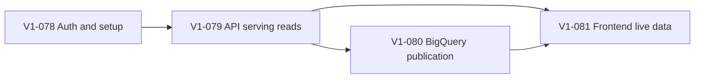

# Runtime Data Availability Amendment

**Decision date:** 2026-09-27
**Approved option:** Option 1, BigQuery analytical source to immutable Firestore serving copy to authenticated Cloud Run API to static frontend.
**Scope:** Correct the deployed V1 runtime data path while preserving Swing, Long-Term research, and manual recommendation-linked paper trading as equal first-class workflows.

## Evidence and decision

The static frontend can load, and the API service is reachable, but analysis requests do not produce application data. The existing code path has four independent gaps:

- protected browser requests can lose or use an expired Firebase token during static navigation;
- the application entry point does not compose the Firestore repositories and analytical read service;
- analysis routes still use permanent `analysis_not_ready` placeholder handlers;
- no concrete bounded BigQuery-to-serving publication path is wired to the existing daily job protocol.

Option 1 resolves these gaps with the least change to the approved architecture. BigQuery remains the analytical source of truth, Firestore receives a compact immutable serving copy, and the API never launches analytical work during a user request. Views and derived tables remain interchangeable physical BigQuery choices and are selected later from measured performance and FinOps evidence.

## Required contracts

| ID | Contract |
|---|---|
| FR-DATA-01 | One named BigQuery input snapshot and rule version produces one immutable analysis batch and one complete Firestore serving copy. |
| FR-DATA-02 | The active serving pointer advances only after all required copies are complete; a failed publication leaves the previous batch active. |
| FR-DATA-03 | Analysis routes read the active batch and return typed `analysis_not_ready` only when no complete batch is available. |
| FR-DATA-04 | A verified first-time user receives `setup_required` without a fabricated preference, fee, paper portfolio, or recommendation. |
| NFR-DATA-01 | Firebase browser auth persists across static navigation and refreshes ID tokens before protected API calls. |
| NFR-DATA-02 | Interactive reads are bounded and batch-pinned; they never run BigQuery calculations. |

## Ticket plan

### Wave 18: auth and runtime state foundation

**Backlog ID:** `V1-078`
**Title:** Make static authentication and first-user runtime state durable
**Estimate:** M
**Files:** `frontend/src/features/auth/`, `backend/app.py`, `backend/contracts/routes.py`, focused auth/runtime tests.

Implement Firebase-managed browser session persistence, `onIdTokenChanged` state, refreshed tokens for API calls, and navigation-safe links. Make `/v1/me` return a typed `setup_required` state when no preference or paper generation exists; do not choose defaults. Preserve current identity, admission, and paper contracts.

**Blocked by:** `V1-074` / issue #79, verified merged release baseline.
**Blocks:** `V1-079` / runtime API composition.
**Acceptance:**

- [ ] Reload and static route navigation preserve a signed-in session and protected API requests use a current token.
- [ ] Sign-out and invalid identity clear protected state and return the client to authentication.
- [ ] A first verified user can call `/v1/me` and receives `setup_required` without a seeded preference document.
- [ ] Tests cover token refresh, auth transitions, missing profile, configured profile, and unchanged admission failures.

### Wave 19: API composition and analytical reads

**Backlog ID:** `V1-079`
**Title:** Wire the API to the active analytical serving batch
**Estimate:** L
**Files:** `backend/main.py`, `backend/app.py`, `backend/read_api/`, `backend/publication/`, `backend/openapi.py`, backend tests.

Compose the existing repositories, publication state, and analytical read service in the FastAPI factory. Replace placeholder analysis routes with bounded batch-pinned reads for Swing, Long-Term, stock detail, and chart responses. Keep `analysis_not_ready` as a typed no-publication outcome and preserve the previous active batch on read failures.

**Blocked by:** `V1-078` and the merged serving/repository contracts already delivered by the prior backlog.
**Blocks:** `V1-080` and `V1-081`.
**Acceptance:**

- [ ] The packaged API starts with the same dependency graph used by tests and production entry points.
- [ ] All four analysis routes read the active immutable batch and return contract-conformant envelopes.
- [ ] No route launches BigQuery or returns an unconditional placeholder 503.
- [ ] Missing publication, stale batch, ownership, pagination, and malformed-symbol cases are tested.

### Wave 20: bounded BigQuery publication

**Backlog ID:** `V1-080`
**Title:** Publish daily analytical results from BigQuery to Firestore atomically
**Estimate:** L
**Files:** `backend/jobs/`, `backend/publication/`, `backend/read_api/`, BigQuery adapters and fixtures, focused worker tests.

Implement the concrete daily worker behind the existing job protocol. Read the named BigQuery input snapshot, invoke the existing versioned analysis calculators once for the shared stock universe, persist immutable analytical evidence and a complete Firestore serving copy, then promote the active pointer. Keep partial batches invisible and make retries idempotent by batch/input/rule identity.

**Blocked by:** `V1-079`.
**Blocks:** `V1-081`.
**Acceptance:**

- [ ] Worker input, rule version, output batch, and publication manifest are explicit and reproducible.
- [ ] A failed copy or retry never exposes a partial batch and never changes the previous active pointer.
- [ ] Repeating the same input/session/rule identity is idempotent and does not duplicate serving documents.
- [ ] Tests cover complete publication, no-publication, retry, partial-write recovery, and unavailable-company outputs.
- [ ] No cloud job, paid query, schedule, seed, or migration is executed by the ticket.

### Wave 21: frontend runtime integration

**Backlog ID:** `V1-081`
**Title:** Connect static workspaces to live analysis data and error states
**Estimate:** M
**Files:** `frontend/src/app/`, `frontend/src/api/`, frontend tests and browser validation fixtures.

Use the generated API client for Swing recommendations, chart data, Long-Term rankings, and paper reads. Render `setup_required`, `analysis_not_ready`, authentication failures, and transport failures as distinct states. Stop suppressing paper refresh failures and keep the existing equal-workflow navigation and accessibility contracts.

**Blocked by:** `V1-079` and `V1-080`.
**Blocks:** the next release acceptance update.
**Acceptance:**

- [ ] Swing renders recommendations and chart series from API responses, not hard-coded empty arrays.
- [ ] Long-Term and paper workspaces load published data and preserve explicit unavailable states.
- [ ] Authentication, setup, analysis-not-ready, and transport errors remain distinguishable to users and tests.
- [ ] Frontend unit, type, build, and browser-flow checks pass against contract fixtures.

## Wave dependency diagram

There are no parallel tickets in this amendment: each wave has a contract consumed by the next. The branches are isolated and the PR unit is one PR per wave, following `AGENTS.md`.

## Explicit non-goals and approval gates

This amendment does not add portfolio tracking, broker integration, automated trades, new indicators, Dividend/Balanced composite scores, production changes, production data copying, user/secret copying, Terraform apply, migration, paid BigQuery queries, data seeding, or schedule activation. After the code waves merge, a separate owner-approved development publication is still required to populate `dev-tradvisor`.
