<!-- tradvisor-v1-tracking-epic -->
## Scope And Authority
Approved sanitized baseline: https://github.com/issacamara/tradvisor/issues/1. Target integration branch: `V1`.
Seven responsibilities: reused Ingestion, Analytical Data and Pipeline Orchestration; new Analysis Engine, Investor Application, Paper Trading and Application Store.
Deliver Swing (EMA20/50, RSI14, ATR14, liquidity and versioned entry/exit rules), equal-priority Long-Term Growth/dividend research, and manual recommendation-linked paper trading with reset/recovery protection.
Static Next.js/TypeScript frontend, FastAPI, shared batch analysis, structured Firestore and existing cloud ingestion foundation. No Dividend/Balanced composite scores or real portfolio tracking in V1.

## Governance
This epic is the scheduling source of truth. No agents are assigned or dispatched. No roster/identity mapping has been established; do not fabricate one. All tickets retain `blocked` while dispatch is disabled, even where `Blocked by: none` means there is no technical predecessor. After graph publication is reconciled, a later explicitly authorized dispatch can evaluate eligibility and change labels.
One active dispatcher, one ticket per agent; reserve the actual agent and file ownership here before dispatch. Re-read issue/PR state and verify predecessor artifacts merged into V1. A closed/cancelled issue or a wave number is not proof of delivery. Recompute conflicts if scope/files change. Agent tasks are not launched by adding an assignee alone.
Existing user work must be preserved. Use the original restricted operator evidence for real environment targeting. This public epic contains no environment inventory or credentials. No production cloning/writes, destructive migration, paid run, plan/apply, seed, or schedule activation is authorized by backlog publication. Deployment and release approvals remain separate.
Estimates: S: up to 2 hours; M: 2-4 hours. Split before implementation if scope exceeds half a day. Re-split oversized work before assigning; external evidence/approval wait is not implementation time. Review-only tasks require the named role's evidence, not invented sign-off. No milestones or delivery-date promises have been introduced.

## Validation
77 tickets, 17 waves, 38 undirected file-conflict pairs. Required fields, acyclic hard-dependency graph, reverse edges, one wave per ticket, predecessors in earlier waves, conflict-free waves and every ticket's path to final release are validated locally. Public safety scans exclude private paths, environment IDs and inventory. Live publication verification is recorded separately; document checks are not passing application tests.

## Tickets And Estimates
| Wave | Ticket | Estimate | Domain |
|---|---|---|---|
| 1 | [#3](https://github.com/issacamara/tradvisor/issues/3) Verify development ownership and preservation inputs | M | infrastructure |
| 1 | [#4](https://github.com/issacamara/tradvisor/issues/4) Build the responsive static investor workspace shell | M | frontend |
| 1 | [#5](https://github.com/issacamara/tradvisor/issues/5) Record legal privacy and advisory release review | S | operations |
| 1 | [#6](https://github.com/issacamara/tradvisor/issues/6) Establish isolated Python package and fixture test foundations | S | contracts |
| 2 | [#7](https://github.com/issacamara/tradvisor/issues/7) Define exact-money scalars and command envelopes | M | contracts |
| 2 | [#8](https://github.com/issacamara/tradvisor/issues/8) Preserve existing Terraform resource ownership | M | infrastructure |
| 3 | [#9](https://github.com/issacamara/tradvisor/issues/9) Define analytical input and result schemas | M | contracts |
| 3 | [#10](https://github.com/issacamara/tradvisor/issues/10) Review the complete preservation-only Terraform plan | S | infrastructure |
| 3 | [#11](https://github.com/issacamara/tradvisor/issues/11) Implement exact paper cost and P&L arithmetic | M | paper |
| 4 | [#12](https://github.com/issacamara/tradvisor/issues/12) Define transactional paper and REST schemas | M | contracts |
| 4 | [#13](https://github.com/issacamara/tradvisor/issues/13) Preserve retry-stable raw ingestion evidence | M | ingestion |
| 4 | [#14](https://github.com/issacamara/tradvisor/issues/14) Define additive analytical source and revision structures | M | infrastructure |
| 4 | [#17](https://github.com/issacamara/tradvisor/issues/17) Build point-in-time analytical session inputs | M | analysis |
| 5 | [#18](https://github.com/issacamara/tradvisor/issues/18) Generate the versioned OpenAPI and TypeScript client | M | contracts |
| 5 | [#19](https://github.com/issacamara/tradvisor/issues/19) Make shared BigQuery loads idempotent and isolated | M | ingestion |
| 5 | [#15](https://github.com/issacamara/tradvisor/issues/15) Configure static hosting and invited identity foundation | M | infrastructure |
| 5 | [#21](https://github.com/issacamara/tradvisor/issues/21) Implement seeded EMA20 and EMA50 with replay anchors | M | analysis |
| 5 | [#22](https://github.com/issacamara/tradvisor/issues/22) Implement Wilder RSI14 and interruption handling | M | analysis |
| 5 | [#23](https://github.com/issacamara/tradvisor/issues/23) Implement Wilder ATR14 with labeled no-trade modeling | M | analysis |
| 5 | [#24](https://github.com/issacamara/tradvisor/issues/24) Calculate complete-window liquidity eligibility | M | analysis |
| 5 | [#25](https://github.com/issacamara/tradvisor/issues/25) Calculate Growth activity and profitability dimensions | M | analysis |
| 5 | [#26](https://github.com/issacamara/tradvisor/issues/26) Calculate sector resilience and valuation dimensions | M | analysis |
| 5 | [#27](https://github.com/issacamara/tradvisor/issues/27) Publish supported dividend facts without composite scores | M | analysis |
| 5 | [#28](https://github.com/issacamara/tradvisor/issues/28) Implement versioned Firestore repositories and transaction seams | M | backend |
| 5 | [#29](https://github.com/issacamara/tradvisor/issues/29) Implement ordered independent recovery-register operations | M | backend |
| 6 | [#30](https://github.com/issacamara/tradvisor/issues/30) Extend CI with isolated contract and application checks | M | ci |
| 6 | [#31](https://github.com/issacamara/tradvisor/issues/31) Normalize issuer identity and financial category evidence | M | ingestion |
| 6 | [#32](https://github.com/issacamara/tradvisor/issues/32) Implement versioned exchange calendar ingestion | M | ingestion |
| 6 | [#33](https://github.com/issacamara/tradvisor/issues/33) Align existing financial PDF extraction entry points | M | ingestion |
| 6 | [#16](https://github.com/issacamara/tradvisor/issues/16) Configure scale-to-zero API and bounded jobs | M | infrastructure |
| 6 | [#34](https://github.com/issacamara/tradvisor/issues/34) Implement the versioned trend-confirmation strategy | M | analysis |
| 6 | [#35](https://github.com/issacamara/tradvisor/issues/35) Compose Growth ratings and independent advisory guards | M | analysis |
| 6 | [#36](https://github.com/issacamara/tradvisor/issues/36) Enforce verified identity and current invitation admission | M | backend |
| 6 | [#37](https://github.com/issacamara/tradvisor/issues/37) Implement recovery-fenced idempotency receipts | M | backend |
| 6 | [#38](https://github.com/issacamara/tradvisor/issues/38) Build sign-in verification and password-reset flows | M | frontend |
| 6 | [#39](https://github.com/issacamara/tradvisor/issues/39) Build the Swing screener and indicator detail | M | frontend |
| 6 | [#40](https://github.com/issacamara/tradvisor/issues/40) Build Growth rankings and first-class dividend research | M | frontend |
| 6 | [#41](https://github.com/issacamara/tradvisor/issues/41) Build paper portfolio reporting and order history | M | frontend |
| 7 | [#42](https://github.com/issacamara/tradvisor/issues/42) Normalize genuine share observations and source sessions | M | ingestion |
| 7 | [#43](https://github.com/issacamara/tradvisor/issues/43) Normalize annual reporting and non-financial inputs | M | ingestion |
| 7 | [#44](https://github.com/issacamara/tradvisor/issues/44) Normalize matching ordinary capitalization evidence | M | ingestion |
| 7 | [#45](https://github.com/issacamara/tradvisor/issues/45) Normalize supported price and share adjustment evidence | M | ingestion |
| 7 | [#46](https://github.com/issacamara/tradvisor/issues/46) Normalize existing dividend payments and coverage | M | ingestion |
| 7 | [#47](https://github.com/issacamara/tradvisor/issues/47) Normalize rating-specific history and loading | M | ingestion |
| 7 | [#20](https://github.com/issacamara/tradvisor/issues/20) Configure transactional storage and protected recovery storage | M | infrastructure |
| 7 | [#48](https://github.com/issacamara/tradvisor/issues/48) Persist immutable analytical batches and readiness manifests | M | analysis |
| 7 | [#49](https://github.com/issacamara/tradvisor/issues/49) Implement paper setup and versioned preferences | M | paper |
| 7 | [#50](https://github.com/issacamara/tradvisor/issues/50) Implement versioned position exit advice | M | paper |
| 7 | [#51](https://github.com/issacamara/tradvisor/issues/51) Implement recovery-safe trusted admission changes | M | backend |
| 7 | [#52](https://github.com/issacamara/tradvisor/issues/52) Implement confirmed paper commands and uncertain-response handling | M | frontend |
| 8 | [#53](https://github.com/issacamara/tradvisor/issues/53) Normalize evidenced banking activity and capital inputs | M | ingestion |
| 8 | [#54](https://github.com/issacamara/tradvisor/issues/54) Normalize evidenced insurance activity and solvency inputs | M | ingestion |
| 8 | [#55](https://github.com/issacamara/tradvisor/issues/55) Publish transactionally guarded execution-price revisions | M | backend |
| 8 | [#56](https://github.com/issacamara/tradvisor/issues/56) Publish complete immutable analytical serving copies | M | backend |
| 9 | [#57](https://github.com/issacamara/tradvisor/issues/57) Package reused ingestion functions with explicit settings | M | infrastructure |
| 9 | [#58](https://github.com/issacamara/tradvisor/issues/58) Accept fresh manual orders with atomic reservations | M | paper |
| 10 | [#59](https://github.com/issacamara/tradvisor/issues/59) Define explicit ingestion workflow dependencies | M | infrastructure |
| 10 | [#60](https://github.com/issacamara/tradvisor/issues/60) Execute or expire pending orders exactly once | M | paper |
| 11 | [#61](https://github.com/issacamara/tradvisor/issues/61) Restore approval-gated development delivery automation | M | ci |
| 11 | [#62](https://github.com/issacamara/tradvisor/issues/62) Implement restrictive-intent-first portfolio reset | M | paper |
| 11 | [#63](https://github.com/issacamara/tradvisor/issues/63) Persist session-ordered position exit references | M | paper |
| 12 | [#64](https://github.com/issacamara/tradvisor/issues/64) Implement bounded authenticated analysis and paper reads | M | backend |
| 12 | [#65](https://github.com/issacamara/tradvisor/issues/65) Integrate source readiness and daily publication | M | analysis |
| 12 | [#66](https://github.com/issacamara/tradvisor/issues/66) Implement evidence-aware retention and reset cleanup | M | backend |
| 12 | [#67](https://github.com/issacamara/tradvisor/issues/67) Implement isolated restore reconciliation and recovery fencing | M | backend |
| 13 | [#68](https://github.com/issacamara/tradvisor/issues/68) Wire protected REST handlers and internal worker entry points | M | backend |
| 13 | [#69](https://github.com/issacamara/tradvisor/issues/69) Review actual source and company-sector coverage | M | qa |
| 14 | [#70](https://github.com/issacamara/tradvisor/issues/70) Connect all static workspaces to the protected API | M | frontend |
| 14 | [#71](https://github.com/issacamara/tradvisor/issues/71) Add bounded operational telemetry and backup alerts | M | operations |
| 14 | [#72](https://github.com/issacamara/tradvisor/issues/72) Verify cross-store and financial mutation races | M | qa |
| 14 | [#73](https://github.com/issacamara/tradvisor/issues/73) Measure pilot latency and calculation placement costs | M | qa |
| 15 | [#74](https://github.com/issacamara/tradvisor/issues/74) Verify complete workflows against WCAG 2.2 AA | M | qa |
| 15 | [#75](https://github.com/issacamara/tradvisor/issues/75) Evaluate provisional financial rules on point-in-time holdouts | M | qa |
| 15 | [#76](https://github.com/issacamara/tradvisor/issues/76) Validate the isolated backup and restore runbook | M | operations |
| 15 | [#77](https://github.com/issacamara/tradvisor/issues/77) Configure bounded operational alerts and log retention | M | infrastructure |
| 16 | [#78](https://github.com/issacamara/tradvisor/issues/78) Review measured whole-stack pilot operating cost | S | operations |
| 17 | [#79](https://github.com/issacamara/tradvisor/issues/79) Assemble pilot acceptance and separate activation approvals | S | operations |

## Wave Plan
| Wave | Tickets | Parallelizability | Rationale |
|---|---|---|---|
| 1 | #3, #4, #5, #6 | May run concurrently after eligibility verification; no shared-file conflicts within this wave | All hard prerequisites are in earlier waves; conflicting owners are serialized |
| 2 | #7, #8 | May run concurrently after eligibility verification; no shared-file conflicts within this wave | All hard prerequisites are in earlier waves; conflicting owners are serialized |
| 3 | #9, #10, #11 | May run concurrently after eligibility verification; no shared-file conflicts within this wave | All hard prerequisites are in earlier waves; conflicting owners are serialized |
| 4 | #12, #13, #14, #17 | May run concurrently after eligibility verification; no shared-file conflicts within this wave | All hard prerequisites are in earlier waves; conflicting owners are serialized |
| 5 | #15, #18, #19, #21, #22, #23, #24, #25, #26, #27, #28, #29 | May run concurrently after eligibility verification; no shared-file conflicts within this wave | All hard prerequisites are in earlier waves; conflicting owners are serialized |
| 6 | #16, #30, #31, #32, #33, #34, #35, #36, #37, #38, #39, #40, #41 | May run concurrently after eligibility verification; no shared-file conflicts within this wave | All hard prerequisites are in earlier waves; conflicting owners are serialized |
| 7 | #20, #42, #43, #44, #45, #46, #47, #48, #49, #50, #51, #52 | May run concurrently after eligibility verification; no shared-file conflicts within this wave | All hard prerequisites are in earlier waves; conflicting owners are serialized |
| 8 | #53, #54, #55, #56 | May run concurrently after eligibility verification; no shared-file conflicts within this wave | All hard prerequisites are in earlier waves; conflicting owners are serialized |
| 9 | #57, #58 | May run concurrently after eligibility verification; no shared-file conflicts within this wave | All hard prerequisites are in earlier waves; conflicting owners are serialized |
| 10 | #59, #60 | May run concurrently after eligibility verification; no shared-file conflicts within this wave | All hard prerequisites are in earlier waves; conflicting owners are serialized |
| 11 | #61, #62, #63 | May run concurrently after eligibility verification; no shared-file conflicts within this wave | All hard prerequisites are in earlier waves; conflicting owners are serialized |
| 12 | #64, #65, #66, #67 | May run concurrently after eligibility verification; no shared-file conflicts within this wave | All hard prerequisites are in earlier waves; conflicting owners are serialized |
| 13 | #68, #69 | May run concurrently after eligibility verification; no shared-file conflicts within this wave | All hard prerequisites are in earlier waves; conflicting owners are serialized |
| 14 | #70, #71, #72, #73 | May run concurrently after eligibility verification; no shared-file conflicts within this wave | All hard prerequisites are in earlier waves; conflicting owners are serialized |
| 15 | #74, #75, #76, #77 | May run concurrently after eligibility verification; no shared-file conflicts within this wave | All hard prerequisites are in earlier waves; conflicting owners are serialized |
| 16 | #78 | Single task | All hard prerequisites are in earlier waves; conflicting owners are serialized |
| 17 | #79 | Single task | All hard prerequisites are in earlier waves; conflicting owners are serialized |

## Dependency Graph
Solid arrows are hard prerequisites. Dotted undirected edges are file-conflict exclusions, not dependencies. Node IDs map to the ticket table; wave planning does not replace current ownership checks.

```mermaid
flowchart TD
  V1006["V1-006 #3"]
  V1055["V1-055 #4"]
  V1073["V1-073 #5"]
  V1075["V1-075 #6"]
  V1001["V1-001 #7"]
  V1007["V1-007 #8"]
  V1002["V1-002 #9"]
  V1008["V1-008 #10"]
  V1044["V1-044 #11"]
  V1003["V1-003 #12"]
  V1009["V1-009 #13"]
  V1024["V1-024 #14"]
  V1025["V1-025 #15"]
  V1026["V1-026 #16"]
  V1029["V1-029 #17"]
  V1004["V1-004 #18"]
  V1010["V1-010 #19"]
  V1027["V1-027 #20"]
  V1030["V1-030 #21"]
  V1031["V1-031 #22"]
  V1032["V1-032 #23"]
  V1033["V1-033 #24"]
  V1035["V1-035 #25"]
  V1036["V1-036 #26"]
  V1038["V1-038 #27"]
  V1040["V1-040 #28"]
  V1050["V1-050 #29"]
  V1005["V1-005 #30"]
  V1011["V1-011 #31"]
  V1012["V1-012 #32"]
  V1014["V1-014 #33"]
  V1034["V1-034 #34"]
  V1037["V1-037 #35"]
  V1041["V1-041 #36"]
  V1042["V1-042 #37"]
  V1056["V1-056 #38"]
  V1057["V1-057 #39"]
  V1058["V1-058 #40"]
  V1059["V1-059 #41"]
  V1013["V1-013 #42"]
  V1015["V1-015 #43"]
  V1018["V1-018 #44"]
  V1019["V1-019 #45"]
  V1020["V1-020 #46"]
  V1021["V1-021 #47"]
  V1039["V1-039 #48"]
  V1043["V1-043 #49"]
  V1045["V1-045 #50"]
  V1052["V1-052 #51"]
  V1060["V1-060 #52"]
  V1016["V1-016 #53"]
  V1017["V1-017 #54"]
  V1046["V1-046 #55"]
  V1047["V1-047 #56"]
  V1022["V1-022 #57"]
  V1048["V1-048 #58"]
  V1023["V1-023 #59"]
  V1049["V1-049 #60"]
  V1028["V1-028 #61"]
  V1051["V1-051 #62"]
  V1076["V1-076 #63"]
  V1053["V1-053 #64"]
  V1062["V1-062 #65"]
  V1063["V1-063 #66"]
  V1064["V1-064 #67"]
  V1054["V1-054 #68"]
  V1069["V1-069 #69"]
  V1061["V1-061 #70"]
  V1065["V1-065 #71"]
  V1066["V1-066 #72"]
  V1068["V1-068 #73"]
  V1067["V1-067 #74"]
  V1070["V1-070 #75"]
  V1071["V1-071 #76"]
  V1077["V1-077 #77"]
  V1072["V1-072 #78"]
  V1074["V1-074 #79"]
  V1075 --> V1001
  V1006 --> V1007
  V1001 --> V1002
  V1007 --> V1008
  V1001 --> V1044
  V1001 --> V1003
  V1002 --> V1003
  V1002 --> V1009
  V1008 --> V1024
  V1002 --> V1024
  V1008 --> V1025
  V1008 --> V1026
  V1002 --> V1029
  V1003 --> V1004
  V1055 --> V1004
  V1009 --> V1010
  V1008 --> V1027
  V1003 --> V1027
  V1029 --> V1030
  V1029 --> V1031
  V1029 --> V1032
  V1029 --> V1033
  V1029 --> V1035
  V1029 --> V1036
  V1029 --> V1038
  V1003 --> V1040
  V1003 --> V1050
  V1004 --> V1005
  V1010 --> V1011
  V1010 --> V1012
  V1010 --> V1014
  V1030 --> V1034
  V1031 --> V1034
  V1032 --> V1034
  V1033 --> V1034
  V1035 --> V1037
  V1036 --> V1037
  V1040 --> V1041
  V1040 --> V1042
  V1055 --> V1056
  V1004 --> V1056
  V1055 --> V1057
  V1004 --> V1057
  V1055 --> V1058
  V1004 --> V1058
  V1055 --> V1059
  V1004 --> V1059
  V1011 --> V1013
  V1012 --> V1013
  V1014 --> V1015
  V1011 --> V1015
  V1011 --> V1018
  V1010 --> V1018
  V1011 --> V1019
  V1010 --> V1019
  V1011 --> V1020
  V1010 --> V1020
  V1011 --> V1021
  V1010 --> V1021
  V1034 --> V1039
  V1037 --> V1039
  V1038 --> V1039
  V1041 --> V1043
  V1042 --> V1043
  V1044 --> V1045
  V1034 --> V1045
  V1003 --> V1045
  V1041 --> V1052
  V1050 --> V1052
  V1056 --> V1060
  V1059 --> V1060
  V1057 --> V1060
  V1015 --> V1016
  V1015 --> V1017
  V1040 --> V1046
  V1012 --> V1046
  V1013 --> V1046
  V1040 --> V1047
  V1039 --> V1047
  V1008 --> V1022
  V1013 --> V1022
  V1015 --> V1022
  V1016 --> V1022
  V1017 --> V1022
  V1020 --> V1022
  V1021 --> V1022
  V1043 --> V1048
  V1045 --> V1048
  V1047 --> V1048
  V1046 --> V1048
  V1022 --> V1023
  V1048 --> V1049
  V1044 --> V1049
  V1005 --> V1028
  V1023 --> V1028
  V1024 --> V1028
  V1025 --> V1028
  V1026 --> V1028
  V1027 --> V1028
  V1043 --> V1051
  V1050 --> V1051
  V1049 --> V1051
  V1045 --> V1076
  V1049 --> V1076
  V1040 --> V1076
  V1041 --> V1053
  V1047 --> V1053
  V1045 --> V1053
  V1049 --> V1053
  V1076 --> V1053
  V1023 --> V1062
  V1024 --> V1062
  V1013 --> V1062
  V1016 --> V1062
  V1017 --> V1062
  V1018 --> V1062
  V1019 --> V1062
  V1020 --> V1062
  V1021 --> V1062
  V1047 --> V1062
  V1046 --> V1062
  V1076 --> V1062
  V1051 --> V1063
  V1047 --> V1063
  V1050 --> V1063
  V1051 --> V1064
  V1052 --> V1064
  V1049 --> V1064
  V1047 --> V1064
  V1053 --> V1054
  V1051 --> V1054
  V1052 --> V1054
  V1062 --> V1069
  V1054 --> V1061
  V1057 --> V1061
  V1058 --> V1061
  V1060 --> V1061
  V1054 --> V1065
  V1062 --> V1065
  V1063 --> V1065
  V1054 --> V1066
  V1064 --> V1066
  V1063 --> V1066
  V1062 --> V1066
  V1062 --> V1068
  V1054 --> V1068
  V1061 --> V1067
  V1062 --> V1070
  V1068 --> V1070
  V1069 --> V1070
  V1064 --> V1071
  V1066 --> V1071
  V1027 --> V1071
  V1028 --> V1071
  V1065 --> V1077
  V1027 --> V1077
  V1026 --> V1077
  V1068 --> V1072
  V1071 --> V1072
  V1065 --> V1072
  V1028 --> V1074
  V1061 --> V1074
  V1062 --> V1074
  V1066 --> V1074
  V1067 --> V1074
  V1069 --> V1074
  V1070 --> V1074
  V1072 --> V1074
  V1073 --> V1074
  V1077 --> V1074
  V1004 -.- V1055
  V1005 -.- V1055
  V1006 -.- V1008
  V1007 -.- V1022
  V1007 -.- V1023
  V1007 -.- V1024
  V1007 -.- V1025
  V1007 -.- V1026
  V1007 -.- V1027
  V1007 -.- V1077
  V1009 -.- V1010
  V1022 -.- V1023
  V1022 -.- V1024
  V1022 -.- V1025
  V1022 -.- V1026
  V1022 -.- V1027
  V1022 -.- V1077
  V1023 -.- V1024
  V1023 -.- V1025
  V1023 -.- V1026
  V1023 -.- V1027
  V1023 -.- V1077
  V1024 -.- V1025
  V1024 -.- V1026
  V1024 -.- V1027
  V1024 -.- V1077
  V1025 -.- V1026
  V1025 -.- V1027
  V1025 -.- V1077
  V1026 -.- V1027
  V1026 -.- V1077
  V1027 -.- V1077
  V1055 -.- V1056
  V1055 -.- V1057
  V1055 -.- V1058
  V1055 -.- V1059
  V1055 -.- V1060
  V1055 -.- V1061
```

## Conflict Register
| Ticket | Conflicts With | Overlapping Files/Modules |
|---|---|---|
| #18 | #4 | `frontend/` |
| #30 | #4 | `frontend/` |
| #3 | #10 | `operator-evidence/infrastructure/` |
| #8 | #57 | `terraform/` |
| #8 | #59 | `terraform/` |
| #8 | #14 | `terraform/` |
| #8 | #15 | `terraform/` |
| #8 | #16 | `terraform/` |
| #8 | #20 | `terraform/` |
| #8 | #77 | `terraform/` |
| #13 | #19 | `archive/legacy-ingestion/scripts/helper.py` |
| #57 | #59 | `terraform/` |
| #57 | #14 | `terraform/` |
| #57 | #15 | `terraform/` |
| #57 | #16 | `terraform/` |
| #57 | #20 | `terraform/` |
| #57 | #77 | `terraform/` |
| #59 | #14 | `terraform/` |
| #59 | #15 | `terraform/` |
| #59 | #16 | `terraform/` |
| #59 | #20 | `terraform/` |
| #59 | #77 | `terraform/` |
| #14 | #15 | `terraform/` |
| #14 | #16 | `terraform/` |
| #14 | #20 | `terraform/` |
| #14 | #77 | `terraform/` |
| #15 | #16 | `terraform/` |
| #15 | #20 | `terraform/` |
| #15 | #77 | `terraform/` |
| #16 | #20 | `terraform/` |
| #16 | #77 | `terraform/` |
| #20 | #77 | `terraform/` |
| #4 | #38 | `frontend/` |
| #4 | #39 | `frontend/` |
| #4 | #40 | `frontend/` |
| #4 | #41 | `frontend/` |
| #4 | #52 | `frontend/` |
| #4 | #70 | `frontend/` |

## Delivery Checklist
- [ ] #3 Verify development ownership and preservation inputs
- [ ] #4 Build the responsive static investor workspace shell
- [ ] #5 Record legal privacy and advisory release review
- [ ] #6 Establish isolated Python package and fixture test foundations
- [ ] #7 Define exact-money scalars and command envelopes
- [ ] #8 Preserve existing Terraform resource ownership
- [ ] #9 Define analytical input and result schemas
- [ ] #10 Review the complete preservation-only Terraform plan
- [ ] #11 Implement exact paper cost and P&L arithmetic
- [ ] #12 Define transactional paper and REST schemas
- [ ] #13 Preserve retry-stable raw ingestion evidence
- [ ] #14 Define additive analytical source and revision structures
- [ ] #15 Configure static hosting and invited identity foundation
- [ ] #16 Configure scale-to-zero API and bounded jobs
- [ ] #17 Build point-in-time analytical session inputs
- [ ] #18 Generate the versioned OpenAPI and TypeScript client
- [ ] #19 Make shared BigQuery loads idempotent and isolated
- [ ] #20 Configure transactional storage and protected recovery storage
- [ ] #21 Implement seeded EMA20 and EMA50 with replay anchors
- [ ] #22 Implement Wilder RSI14 and interruption handling
- [ ] #23 Implement Wilder ATR14 with labeled no-trade modeling
- [ ] #24 Calculate complete-window liquidity eligibility
- [ ] #25 Calculate Growth activity and profitability dimensions
- [ ] #26 Calculate sector resilience and valuation dimensions
- [ ] #27 Publish supported dividend facts without composite scores
- [ ] #28 Implement versioned Firestore repositories and transaction seams
- [ ] #29 Implement ordered independent recovery-register operations
- [ ] #30 Extend CI with isolated contract and application checks
- [ ] #31 Normalize issuer identity and financial category evidence
- [ ] #32 Implement versioned exchange calendar ingestion
- [ ] #33 Align existing financial PDF extraction entry points
- [ ] #34 Implement the versioned trend-confirmation strategy
- [ ] #35 Compose Growth ratings and independent advisory guards
- [ ] #36 Enforce verified identity and current invitation admission
- [ ] #37 Implement recovery-fenced idempotency receipts
- [ ] #38 Build sign-in verification and password-reset flows
- [ ] #39 Build the Swing screener and indicator detail
- [ ] #40 Build Growth rankings and first-class dividend research
- [ ] #41 Build paper portfolio reporting and order history
- [ ] #42 Normalize genuine share observations and source sessions
- [ ] #43 Normalize annual reporting and non-financial inputs
- [ ] #44 Normalize matching ordinary capitalization evidence
- [ ] #45 Normalize supported price and share adjustment evidence
- [ ] #46 Normalize existing dividend payments and coverage
- [ ] #47 Normalize rating-specific history and loading
- [ ] #48 Persist immutable analytical batches and readiness manifests
- [ ] #49 Implement paper setup and versioned preferences
- [ ] #50 Implement versioned position exit advice
- [ ] #51 Implement recovery-safe trusted admission changes
- [ ] #52 Implement confirmed paper commands and uncertain-response handling
- [ ] #53 Normalize evidenced banking activity and capital inputs
- [ ] #54 Normalize evidenced insurance activity and solvency inputs
- [ ] #55 Publish transactionally guarded execution-price revisions
- [ ] #56 Publish complete immutable analytical serving copies
- [ ] #57 Package reused ingestion functions with explicit settings
- [ ] #58 Accept fresh manual orders with atomic reservations
- [ ] #59 Define explicit ingestion workflow dependencies
- [ ] #60 Execute or expire pending orders exactly once
- [ ] #61 Restore approval-gated development delivery automation
- [ ] #62 Implement restrictive-intent-first portfolio reset
- [ ] #63 Persist session-ordered position exit references
- [ ] #64 Implement bounded authenticated analysis and paper reads
- [ ] #65 Integrate source readiness and daily publication
- [ ] #66 Implement evidence-aware retention and reset cleanup
- [ ] #67 Implement isolated restore reconciliation and recovery fencing
- [ ] #68 Wire protected REST handlers and internal worker entry points
- [ ] #69 Review actual source and company-sector coverage
- [ ] #70 Connect all static workspaces to the protected API
- [ ] #71 Add bounded operational telemetry and backup alerts
- [ ] #72 Verify cross-store and financial mutation races
- [ ] #73 Measure pilot latency and calculation placement costs
- [ ] #74 Verify complete workflows against WCAG 2.2 AA
- [ ] #75 Evaluate provisional financial rules on point-in-time holdouts
- [ ] #76 Validate the isolated backup and restore runbook
- [ ] #77 Configure bounded operational alerts and log retention
- [ ] #78 Review measured whole-stack pilot operating cost
- [ ] #79 Assemble pilot acceptance and separate activation approvals

## Reservations And First-Wave Assignments
None. Dispatch is disabled. First-wave work is technically independent local foundations plus restricted infrastructure/compliance review; no agent availability or authorization is presumed. Infrastructure read/plan permission and legal/operator decisions must be established by the future owner.

## Release Gates
Verify source/company-sector coverage, point-in-time financial evaluation, contract/concurrency tests, complete-workflow accessibility, pilot load/batch targets, measured whole-stack cost, isolated restore drill, legal/privacy/disclaimer review and named operator/support. Final launch requires product-owner acceptance. New development schedules remain paused until activation is explicitly approved. Missing data stays unavailable; never relax scoring or recovery safeguards to make a gate pass.
