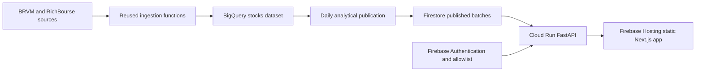

# Tradvisor V1 Architecture

**Status:** Active V1 architecture

## Scope

Tradvisor V1 is a read-only BRVM research application with two equal workflows:

- **Swing:** daily technical entry research for the listed equity universe.
- **Long-Term:** Growth ranking, company evidence, and dividend facts where the source coverage supports them.

The product publishes research, explanations, and evidence. It does not maintain portfolios, accept orders, execute transactions, track cash or positions, or connect to a broker.

## System Design

The static Next.js application uses authenticated client requests to the Cloud Run API. The API verifies Firebase identity, verified email, and the current allowlist before returning published analytical data. The browser never accesses BigQuery or writes Firestore directly.

## Data Flow

1. Existing ingestion functions collect company, share, dividend, financial, and rating data into `dev-tradvisor.stocks`.
2. A daily analytical job reads only the necessary partitioned BigQuery history, calculates indicators and Long-Term inputs, and writes an immutable publication batch.
3. The job validates the candidate batch and atomically updates `publication_state/current` only after all required serving documents are present.
4. Firestore serves compact, read-optimized publication documents. BigQuery remains the analytical source of truth and is never queried by an interactive request.
5. The API reads the active publication, returns typed availability states for missing or warming inputs, and exposes chart observations for the selected symbol.

## Components

| Component | Responsibility |
|---|---|
| Ingestion | Reuse the BRVM/RichBourse collection functions; retain source metadata, session date, and ingestion outcome. |
| BigQuery | Store canonical source tables and partitioned analytical inputs. |
| Analysis job | Calculate EMA20/EMA50, RSI14, ATR14, traded-value liquidity, Swing entry state/strength, and Long-Term Growth research. |
| Firestore | Store immutable analytical batches and one active-publication pointer only. |
| Cloud Run API | Authenticate requests and expose read-only analytical resources. |
| Firebase Hosting | Deliver the static frontend. |
| Firebase Authentication | Authenticate users; the API additionally enforces verified-email and allowlist admission. |

## Analytical Rules

Swing uses EMA 20/50, Wilder RSI 14, and Wilder ATR 14. A Buy requires an unrounded strength of at least 70. Liquidity, current-trade, and structural guards are published as explanatory evidence and do not veto a qualifying score. A result that cannot be established is explicitly `insufficient_data`; it is never inferred as Buy or Sell.

Long-Term V1 publishes Growth scores when required financial inputs are available. Dividend payments and conditional historical yield remain research facts; Dividend and Balanced composite scores are deferred. Every result identifies its batch, effective date, rule version, calculation status, and evidence references.

## Firestore Serving Model

| Document path | Responsibility |
|---|---|
| `analysis_batches/{batch_id}` | Batch manifest, source snapshot, rule version, session date, and publication timestamp. |
| `analysis_batches/{batch_id}/swing/{symbol}` | Swing entry state, strength, eligibility guards, and indicator evidence. |
| `analysis_batches/{batch_id}/long_term/{symbol}` | Growth score, advisory state, factor contributions, and evidence. |
| `analysis_batches/{batch_id}/charts/{symbol}` | Bounded dated close-price observations used by the frontend chart. |
| `publication_state/current` | Active complete batch identifier and publication metadata. |

These documents are rebuildable analytical serving copies. No user financial state is stored in Firestore.

## API Contract

The read-only API surface is:

| Endpoint | Purpose |
|---|---|
| `GET /v1/me` | Current admitted identity. |
| `GET /v1/swing/recommendations` | Published Swing screening results. |
| `GET /v1/long-term/rankings` | Published Long-Term Growth research. |
| `GET /v1/stocks/{symbol}` | Company and published analytical detail. |
| `GET /v1/stocks/{symbol}/chart` | Bounded close-price observations for a selected stock. |

Responses use the standard `data` and `meta` envelope and include explicit unavailable states. There are no mutation endpoints in V1.

## Deployment and Cost Controls

- Firebase Hosting serves the static frontend.
- Cloud Run API uses zero minimum instances and request-based billing.
- Heavy calculations run once per daily batch, preferably in BigQuery, not on interactive API requests.
- BigQuery source and analytical tables use partitioning and only select the necessary symbols, dates, and columns.
- Terraform declares development resources in `dev-tradvisor`; production remains isolated and read-only unless separately approved.
- Deploy through the repository GitHub Actions workflow after a committed, pushed change and passing CI.

## Security and Operations

- Firebase Authentication handles password, verification, and reset flows.
- The API fails closed if identity or allowlist admission cannot be verified.
- The frontend has no service-account credentials and no direct Firestore write capability.
- Published batches are immutable. A failed daily run leaves the most recent complete batch active and visible with its original date.
- Logs contain operational metadata only and never carry user secrets or credentials.

## Retired V1 Surface

The former simulated-trading workflow, its API routes, frontend page, backend modules, Firestore documents, tests, and backlog artefacts are removed from V1. Future product work would require a new approved architecture and contract rather than reusing retired data or code.
